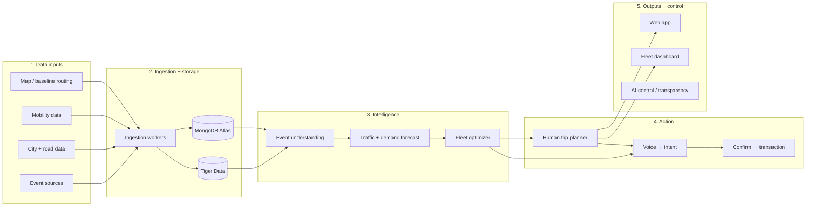

# Transpeaktation System Architecture

Event-aware predictive routing. Folder owners and data store details: `AGENTS.md`.

## 1. Data inputs → `ingest/`
Sources and status: `ingest/TODO.md`.

| Input | What | Examples |
|---|---|---|
| Event sources | concerts, sports, festivals, holidays, venue calendars | PredictHQ or Ticketmaster (undecided) |
| City + road data | closures, permits, restrictions, road conditions | DataSF, Caltrans, CHP, 511 |
| Mobility data | live traffic, destination status | 511, Muni vehicles; destination demand is derived in `ml/` |
| Map / baseline routing | road graph, candidate routes, baseline + live ETA, corridor speeds | OpenStreetMap (OSMnx), Mapbox Directions (`pull.poll`) |

## 2. Ingestion + storage → `ingest/` (DigitalOcean)
Ingestion workers normalize crawler / API data, dedupe events, geocode locations, and build clean event + road records.

| Store | Best for | Holds |
|---|---|---|
| MongoDB Atlas | long-lived entities, nested JSON | events, venues, users, trips, bookings, route plans, privacy settings, road segments, vehicles, road incidents |
| Tiger Data | time-series, fast-changing numbers | traffic speed + congestion, AV positions, demand, model predictions, simulation metrics |

Schemas: `AGENTS.md` → Data stores; Tiger DDL in `contracts/tiger_schema.sql`.

## 3. Intelligence → `ml/`
| Component | Does | Stack |
|---|---|---|
| Event understanding | extract event type, location, time; estimate attendance; normalize messy public info | Gemini API |
| Traffic + demand forecast | predict event-induced congestion per road segment + arrival time; predict ride-request surges → `prediction_metrics` | Python ML |
| Fleet optimizer | joint route assignment, staging pickup zones, fleet rebalancing, avoid vehicle concentration | Python (Waymo track) |

## 4. Action → `api/`
| Component | Does | Stack |
|---|---|---|
| Human trip planner | fastest-now vs event-aware route or a better departure time; AI explains why the route changed | FastAPI (Microsoft track) |
| Voice → intent | hands-free requests, e.g. "Plan and book my ride." | ElevenLabs |
| Confirm → transaction | user explicitly confirms payment / booking, then the Solana tx runs. Voice never authorizes spending. | Solana |

## 5. Outputs + control → `web/`
| Surface | Shows | Track |
|---|---|---|
| Web app | trip planning, event warnings, route explanation, recommended departure time | Microsoft |
| Fleet dashboard | predicted event zones, fleet distribution, route assignments, system-wide delay | Waymo |
| AI control / transparency | what AI used, what was stored, privacy controls, personalization choices | Assurant |

## 6. Deployment
| Layer | Stack | Host |
|---|---|---|
| Frontend | Next.js, React, TypeScript | — |
| Backend + models | Python, FastAPI, workers, optimization engine | DigitalOcean |
| Public demo | Transpeaktation demo domain | GoDaddy |
