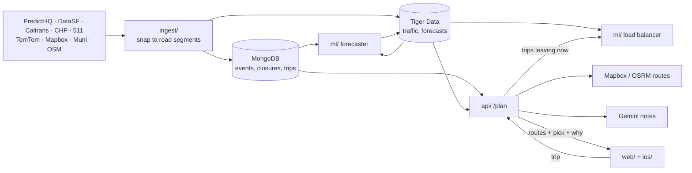

<p align="center">
  <picture>
    <source media="(prefers-color-scheme: dark)" srcset="web/public/wordmark-dark.svg">
    
  </picture>
</p>

<p align="center"><b>Event-aware routing that plans the whole crowd, not just your car.</b><br>
San Francisco · by YoWayMo</p>

<p align="center">
  <a href="https://yowaymo.us">Live app</a> ·
  <a href="https://yowaymo.us/about">About + demo</a> ·
  <a href="#how-the-models-work">Models</a> ·
  <a href="#status-and-next-steps">Next steps</a> ·
  <a href="#contributing">Contributing</a> ·
  <a href="LICENSE">AGPL-3.0</a>
</p>

---

When the July 4 fireworks end, thousands of cars leave at once, and every navigation app sends them all down the same "fastest" route until it isn't. **transPEAKtation** sees the crowd coming and routes it together:

- **Knows the events:** games, concerts and festivals (PredictHQ), plus closures, permits and incidents (DataSF, Caltrans, CHP, 511), mapped onto road segments.
- **Forecasts the jam:** a traffic forecast for every SF road, 10–60 minutes ahead, from live TomTom and Mapbox speeds.
- **Spreads riders:** it remembers which roads it has sent other riders down, and nudges the next one onto a route a few minutes slower instead of piling on.
- **Explains itself:** plain-language route notes (Gemini). You can also speak your destination (ElevenLabs).
- **Rewards the detour:** a small devnet SOL reward for taking the recommended route. Riders never sign or spend.
- **Community events:** anyone can add an event to the map. There are no accounts, and these events never change routing.
- **Private:** trips are logged at ~100 m, not linked to you, and logging and AI can be switched off.

Try it at **[yowaymo.us](https://yowaymo.us)** or watch the one-minute simulation at **[yowaymo.us/about](https://yowaymo.us/about)**.

## How it works



| Folder | What | Stack |
|---|---|---|
| [`ingest/`](ingest) | Pulls every feed, snaps it to OSM road segments in 10-min buckets, writes the databases | Python, MongoDB Atlas, Tiger Data |
| [`ml/`](ml) | SUMO scenarios, the traffic forecaster, the load balancer, RL research | Python, PyTorch, SUMO |
| [`api/`](api) | Places, routes, trip planning (`/plan`), voice, rewards, community events | FastAPI, Mapbox/OSRM, OSMnx, Solana |
| [`web/`](web) | The app (desktop + mobile, light/dark/pride) and `/about` | Next.js 16, React 19, Leaflet |
| [`ios/`](ios) | SwiftUI shell around the web app's mobile layout | SwiftUI, XcodeGen |
| [`demo/`](demo) | The fireworks simulation and the pitch video | HTML, canvas, SUMO |
| [`contracts/`](contracts) · [`deploy/`](deploy) | Shared data shapes · the DigitalOcean droplet | JSON Schema, SQL · Caddy, systemd |

More: [`ARCHITECTURE.md`](ARCHITECTURE.md). Data stores and conventions: [`AGENTS.md`](AGENTS.md). Planned but not built: a fleet dashboard, demand forecasting, Gemini event understanding.

## How the models work

Each layer works without the next one.

1. **Candidate routes.** Mapbox (or OSRM without a key) returns a few routes, which are snapped to road segments. With nothing else running, the pick is the fastest.
2. **Forecaster** (`ml/forecast`, `event_patch_v2_main`). A ~372k-parameter transformer predicts travel time on ~26,400 SF roads for the next six 10-min buckets.
   - **Inputs:** the last hour of observed congestion (TomTom, then Mapbox; Muni is left out because buses run slow), road attributes, and scheduled closures and event hours.
   - **How it works:** each road attends to its own history, nearby roads, a city-wide summary and its legal-turn neighbours, and an event branch adjusts roads near upcoming events.
   - **Live:** it runs at most once per bucket, only when asked. Ingest lags real time by 10–25 min, so it covers ~35–50 min ahead.
3. **Load balancer** (`ml/coordination`, trips leaving now only).
   - **Candidates:** up to 5 legal routes, each ≤ min(5 min, 25%) slower than the fastest, timed on the forecast. A road closed at that time is ruled out.
   - **Score:** a ledger counts riders already sent down each road per 5 min. Routes score `ETA + λ·ΔΦ`, where `Φ = Σ(load/budget)²` and `λ = 60 s`, so a filling road costs more.
   - **Who decides:** that rule picks normally. A PPO policy trained in SUMO takes over when the fastest route is predicted congested (≤ 50% of free-flow speed).
   - **Reservation:** the route is held while the rider drives and released on arrival.

Around the pick, a simple event rule (`api/app/model.py`: +2/5/10 min near small/medium/big crowds, +90 s per incident) annotates the *other* route cards, and Gemini words the notes. Anything the load balancer can't serve (arrive-by, later trips, replays, outages) falls back to layer 1. `/plan`'s `data.decision` says which layer decided.

**What's measured.** Everything is **SUMO simulation** on real SF roads and closures, with assumed demand. Nothing has been validated on real traffic yet.

| Question | Result |
|---|---|
| Forecaster vs. "traffic stays as it is" | **−33%** travel-time error (2.33 s vs 3.48 s per road) on a held-out event ([report](ml/reports/forecast_event_patch_v2_main.md)) |
| Does the event branch help? | Not measurably; fine-tuning it wasn't promoted ([report](ml/reports/event_awareness_finetuning_v3.md)) |
| Load balancing, normal event traffic, 5–30% adoption | No measurable change (−0.011% vehicle time) ([report](ml/reports/load_balancing_backtest_8b54466fa9.md)) |
| Load balancing, fireworks exodus (6,000 cars, PPO) | App riders' trips 19% faster at 30% adoption, up to 59% at 100%. City-wide time gets *worse* at 30–50% adoption and better only from 80% (−27%) ([pitch data](demo/video/pitch.html), [protocol](ml/SIMULATION_EXPERIMENT_STANDARD.md)) |

In short, spreading riders only pays off when a large share of an overloaded crowd uses the app. That's why the learned policy only kicks in under predicted congestion.

## Quick start (no keys needed)

Needs **Git**, **Node 20.9+** and **Python 3.10+**.

```bash
git clone https://github.com/No-Way-Mo/transpeaktation.git && cd transpeaktation
node demo/check.mjs && open demo/index.html          # the demo (Windows: start demo/index.html)

# terminal 1: the API → http://localhost:8000/docs   (Windows: .venv/Scripts/)
cd api && python3 -m venv .venv && .venv/bin/pip install -e '.[test]' && .venv/bin/uvicorn app.main:app --reload

# terminal 2: the app → http://localhost:3000   (≤760px wide = mobile layout)
cd web && npm install && npm run dev
```

Without keys, routes come from OSRM + Nominatim, events are demo data and notes use templates. `/health` shows which inputs are live.

## Setup

**Secrets.** Copy each `.env.example` to `.env` (gitignored): `for d in ingest ml api web; do cp -n $d/.env.example $d/.env; done`. Every key is optional, and each is commented with where to get it.

| Key | Unlocks |
|---|---|
| `MAPBOX_TOKEN` | Traffic-aware routes, place search, ingest speed polling |
| `MONGODB_URI`, `TIGER_DATABASE_URL` | Real events, closures, traffic, forecasts, trip log, rewards, community events |
| `PREDICTHQ_TOKEN`, `SF511_API_KEY`, `TOMTOM_API_KEY`, `DATASF_APP_TOKEN` (ingest) | Events; 511 + Muni; TomTom speeds; a higher DataSF rate limit |
| `GEMINI_API_KEY`, `ELEVENLABS_API_KEY`, `SOLANA_TREASURY_KEY` (api) | Route notes; voice; devnet rewards (`python -m app.rewards keygen`) |
| `COORDINATION_URL` + `_API_TOKEN` (api) | `ml/`'s load balancer (`ML_URL` is an unimplemented alternative hook) |
| `INGEST_TOKEN` (ingest) | The on-demand refresh endpoint (`python -m worker serve`) |

The API also reads `ingest/.env` locally. **Databases:** use your own free MongoDB Atlas + Tiger Data (TimescaleDB), keep the URLs in double quotes, then run `python -m worker bootstrap` in `ingest/` (schema, indexes, road segments). Schemas are in [`AGENTS.md`](AGENTS.md) → Data stores. Core team members use the shared databases (`AGENTS.md` → Team setup).

**Ingest.**
```bash
cd ingest && python3 -m venv .venv && .venv/bin/pip install -e '.[osm,db,live]'
.venv/bin/python -m pull && .venv/bin/python -m pull.check   # pull every source + quality report
.venv/bin/python -m pull.poll                                # live speeds every 10 min
.venv/bin/python -m worker schedule                          # load everything into the databases on a timer
```
One-off commands: `worker run traffic|incidents|events|segments`; `worker backfill --date YYYY-MM-DD` loads a past day for replays. See [`ingest/DESIGN.md`](ingest/DESIGN.md) and [`ingest/TODO.md`](ingest/TODO.md).

**API.** `GET /plan?from=lon,lat&to=lon,lat[&depart_at|arrive_by=ISO]` returns routes, the events/closures/traffic on them, the pick and why. Options: `save=false` (not logged), `ai_text=false` (nothing sent to Gemini), `replay=true` (a past trip). Other endpoints cover places, routes, the trip lifecycle and rewards, voice, events, community events, road conditions and traffic; they're listed at `/docs`. The first start downloads the SF road graph (~15 s).

**ML.** Four parts, each with its own install extra: `eventsim` (SUMO scenarios), `forecast`, `coordination` (load balancer) and `rl`. Commands are in [`AGENTS.md`](AGENTS.md) → Run. The forecaster and load balancer run on their own droplet ([`ml/deploy/README.md`](ml/deploy/README.md)). Results are in [`ml/reports/`](ml/reports).

**Web.** Set `NEXT_PUBLIC_API_URL` in `web/.env` (default `http://localhost:8000`). `NEXT_PUBLIC_REPLAY=1` allows past dates. The map's event heatmap is the `snapmap` experiment (`NEXT_PUBLIC_MAP_EXPERIMENT=off` hides it). Saved events, host keys, recent searches and settings stay in the browser.

**iOS.** Start the API and web app, then `open ios/Transpeaktation.xcodeproj` and Run. For a real iPhone, set `WEB_APP_URL` in `ios/project.yml` to your Mac's LAN IP, then run `cd ios && xcodegen`.

**Deployment.** [yowaymo.us](https://yowaymo.us) is one DigitalOcean droplet: Caddy serves the web app at `/`, the API at `/api/*` and the demo at `/demo/`, and systemd runs the API, web, poller and worker. A green push to `main` redeploys it.

| Problem | Fix |
|---|---|
| mongosh `Server selection timed out` | Your IP isn't on the Atlas access list |
| `bad auth` | Wrong password, or `<password>` still in `.env` |
| `. ingest/.env` → `command not found` | A database URL lost its double quotes |
| `skip: needs osmnx` | Use `.venv/bin/python`, not the system `python` |
| "Couldn't load routes." / iOS "Can't reach transPEAKtation" | The API / `npm run dev` isn't running |
| Community events "unavailable" | `MONGODB_URI` isn't set for the API |
| `CERTIFICATE_VERIFY_FAILED` (Windows) | `pip install certifi` in the venv |

## Status and next steps

**Live now:** trip planning with live data, the load balancer on the live forecast, Gemini notes, voice, devnet rewards, community events, the iOS shell and 10-minute ingest.

**Known limits:**
- Models are simulation-only.
- The forecast reaches ~35–50 min ahead, has no confidence value, and has an observed speed for only ~36% of roads per bucket.
- The load balancer assumes riders follow their route.
- Road matching is nearest-edge, and voice parsing uses regexes.
- The API runs as a single server.

| Area | Next |
|---|---|
| Validation | Test on the Folsom Street Fair (2026-09-27), the first measured event traffic (review its closures first); calibrate simulated demand, signals and lanes ([ml/README](ml/README.md)) |
| Forecaster | More event families; make the event branch earn its place; add confidence; a 3-hour model ([plan](ml/LONG_HORIZON_RETRAINING_PLAN.md)) |
| Load balancer | Model riders who don't follow their route; tune on development scenarios; re-run the held-out test with the adaptive policy; move its API shape into `contracts/` ([plan](ml/LOAD_BALANCING_BACKTEST_PLAN.md)) |
| Ingest | Calibrate Mapbox congestion levels; load 511/WZDx incidents; merge duplicate special events; add holidays ([TODO](ingest/TODO.md)) |
| Web | Connect the "Event Activity" layer toggle to the heatmap; draw closures on the map; notifications; fleet dashboard |
| Demo · Community | A real SUMO run for the demo's second act ([guide](demo/ACT2_GUIDE.md)) · paid promotion, visibility only ([contract](contracts/community_event.md)) |
| Docs | `ml/coordination` and `ml/forecast` READMEs still describe the live path as unfinished; `ARCHITECTURE.md` lists Gemini event understanding |

## Contributing

1. **Open an issue** for anything bigger than a small fix.
2. **Branch per task** as `<folder>/<short-desc>`. Keep PRs small and to one folder. Folders talk only through [`contracts/`](contracts) and HTTP/databases, and `contracts/` changes go in their own PR.
3. **Run the tests** for what you touched. CI runs api, ingest, web and demo; run ml's yourself (`AGENTS.md` → Run).
   ```bash
   cd api && .venv/bin/python -m unittest discover -s tests -t .      # same command in ingest/
   cd web && npm test && npm run build
   node demo/check.mjs
   ```
4. **Never commit secrets.** New keys go in that folder's `.env.example`.
5. **Match the surrounding code.** Conventions are in [`AGENTS.md`](AGENTS.md).

A green merge to `main` deploys to [yowaymo.us](https://yowaymo.us). Contributions are licensed under AGPL-3.0.

## License

**GNU AGPL v3.0** ([`LICENSE`](LICENSE)). You can use, modify and share it, but if you distribute it **or run a modified version as a network service**, you must publish your full source under the same license. OpenStreetMap data is © OpenStreetMap contributors (ODbL). Mapbox, TomTom, PredictHQ, 511.org, Esri, Gemini and ElevenLabs need your own accounts and follow their own terms.
