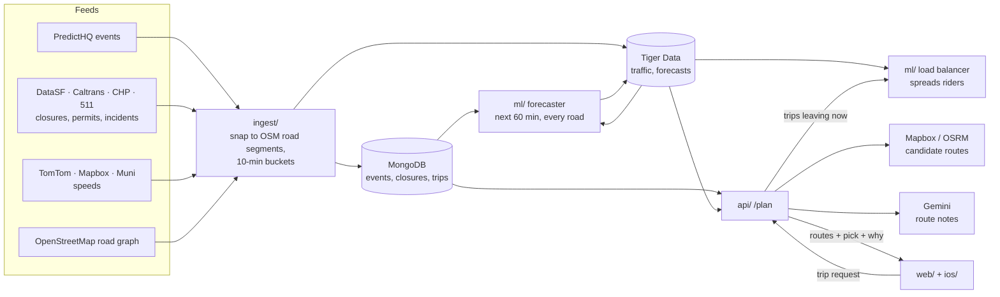

<p align="center">
  <picture>
    <source media="(prefers-color-scheme: dark)" srcset="web/public/wordmark-dark.svg">
    
  </picture>
</p>

<p align="center"><b>Event-aware routing that plans the whole crowd, not just your car.</b><br>
San Francisco · by YoWayMo</p>

<p align="center">
  <a href="https://yowaymo.us">Live app</a> ·
  <a href="https://yowaymo.us/about">About + demo</a> ·
  <a href="ARCHITECTURE.md">Architecture</a> ·
  <a href="#how-the-models-work">How the models work</a> ·
  <a href="#status-and-next-steps">Next steps</a> ·
  <a href="#contributing">Contributing</a> ·
  <a href="LICENSE">AGPL-3.0</a>
</p>

---

When the July 4 fireworks end, thousands of cars leave the waterfront at once. Every navigation app routes each driver on its own, so 100 people going from A to B all get the same "fastest" route, and it stops being fast.

**transPEAKtation** sees the crowd coming and routes it together:

- **Knows the events.** Concerts, games, parades and festivals (PredictHQ) plus street closures, permits and incidents (DataSF, Caltrans, CHP), mapped onto the road segments they'll clog.
- **Forecasts the jam.** Live TomTom and Mapbox speeds, plus scheduled closures and events, feed a traffic forecast for every road segment, 10 to 60 minutes ahead.
- **Spreads riders across routes.** It remembers which roads its other riders have been sent down, so it can put the next rider on a good route a few minutes slower than the fastest, instead of sending everyone down one street.
- **Explains itself.** Each route card says, in plain language, why it was picked (Google Gemini). You can also just say where you're going (ElevenLabs voice).
- **Rewards the detour.** Take the recommended route and get a small reward in devnet SOL. Riders never sign or spend anything.
- **Lets riders add events.** Anyone can put an event on the map (☰ → Add Event), then edit it from My Events, save others' events, share a link or report one. No accounts: a per-event host key stays in your browser. Community events are map-only and never change routing.
- **Respects privacy.** Trips are logged at area level (~100 m), not linked to the rider, and you can turn logging and AI off.

Try it at **[yowaymo.us](https://yowaymo.us)**, or watch the one-minute simulation at **[yowaymo.us/about](https://yowaymo.us/about)**.

## How it works



The [models section](#how-the-models-work) below explains each step, what's measured and what isn't. Planned but not built: a fleet dashboard, demand forecasting, and Gemini event understanding in `ml/` (see [`ARCHITECTURE.md`](ARCHITECTURE.md)).

| Folder | What it is | Stack |
|---|---|---|
| [`ingest/`](ingest) | Pulls events (PredictHQ), closures, permits and incidents (DataSF, Caltrans, CHP, 511), live traffic (Mapbox, TomTom, Muni) and the OSM road graph; normalizes onto OSM road segments and writes the databases | Python, MongoDB Atlas, Tiger Data (TimescaleDB) |
| [`ml/`](ml) | SUMO event scenarios, the citywide event-conditioned traffic forecast, the crowd load balancer (coordinated routing) and RL route selection research; forecast + load balancer run as their own services | Python, PyTorch, SUMO, OR-Tools |
| [`api/`](api) | Places, traffic-aware routes, trip planning (`/plan`), voice, route rewards, community events | FastAPI, Mapbox / OSRM, OSMnx, Gemini, ElevenLabs, Solana |
| [`web/`](web) | The trip planning app (desktop + mobile layouts, light / dark / pride themes), community events and the `/about` page | Next.js 16, React 19, TypeScript, Leaflet |
| [`ios/`](ios) | SwiftUI shell that runs the web app's mobile layout | SwiftUI, WebKit, XcodeGen |
| [`demo/`](demo) | Standalone one-minute simulation of the July 4 fireworks exodus (the baseline half replays a real SUMO run; `?theme=light` for light mode), plus the ~3-minute pitch video ([`demo/video/`](demo/video/README.md)) | HTML, canvas, SUMO |
| [`contracts/`](contracts) | The data shapes shared between folders | JSON Schema, SQL, Markdown |
| [`deploy/`](deploy) | The DigitalOcean droplet: Caddy, systemd, redeploy on green `main` | Caddy, systemd |

The full picture is in [`ARCHITECTURE.md`](ARCHITECTURE.md). Data store schemas and conventions are in [`AGENTS.md`](AGENTS.md).

## How the models work

A trip request goes through up to three layers. Each one works without the next.

**1. Candidate routes (always).** The API asks Mapbox (live traffic) or, without a key, OSRM for up to a few routes and snaps each one onto OSM road segments. With nothing else running, the recommended route is simply the provider's fastest.

**2. The traffic forecaster (`ml/forecast`, model `event_patch_v2_main`).** It predicts travel time on each of San Francisco's ~26,400 road segments for the next six 10-minute buckets.
- *Inputs:* the last hour of observed congestion per road from Tiger (TomTom first, then Mapbox; Muni is left out because buses run slow), road attributes (length, lanes, signals, class), and the scheduled context from Mongo: closures and, when a DataSF event closure sits within 500 m of a PredictHQ event, that event's hours.
- *Model:* a spatio-temporal transformer (~372k parameters). Each road looks at its own recent history, at nearby roads (patches of ~128), at summaries of every patch in the city, and along legal turns to its up- and downstream neighbours. An event branch nudges each road's layers (FiLM) based on nearby closures and event times, so a game starting in 30 minutes can raise the 40–60 min forecast before any slowdown shows up. It outputs a log travel-time ratio, so speed, delay and congestion always agree.
- *Live use:* it runs at most once per 10-minute bucket, only when a rider asks, and writes the map to Tiger `prediction_metrics` ([`contracts/congestion_map.md`](contracts/congestion_map.md)). Ingest lags real time by 10–25 min, so the map covers about the next 35–50 minutes.

**3. The load balancer (`ml/coordination`, trips leaving now).** It turns one rider's trip into a choice that accounts for everyone else it has routed.
- It finds up to 5 legal routes, each at most min(5 min, 25%) slower than the fastest, and times each road on the forecast at the moment the car would enter it. A road closed then is not allowed.
- A shared ledger counts the riders already sent down each road in 5-minute bins. Each route is scored `ETA + λ·[Φ(load + this route) − Φ(load)]` with `Φ = Σ (load / budget)²` and `λ = 60 s`. A road that's filling up gets more expensive, so the next rider is nudged elsewhere, but only by what it costs them in time.
- The deployed policy is **adaptive**. That score (the heuristic) decides normally; when the fastest route is predicted to be congested (≤ 50% of free-flow speed) or over its budget, a reinforcement-learning policy (PPO, trained in SUMO) decides instead.
- The chosen route is reserved for 60 s, confirmed when the rider starts (`/trips/{id}/start`) and released on arrival or cancel.
- It's shown as the transPEAKtation card. Its time is the provider's fastest ETA × (the forecast's ratio of this route to its own fastest), so the card shows the real cost of spreading riders.

**Around the pick.** The API's event-impact heuristic (`api/app/model.py`) never changes the pick. It adds an estimate to the *other* route cards: +2 / 5 / 10 min near small / medium / big crowds while they arrive or leave, fading 200–700 m from the venue, plus 90 s per incident and a 20 min penalty for a closure on the way. Gemini rewords those facts into the card notes, and falls back to template text. Arrive-by, later departures, replays, trips past the forecast horizon, or a load balancer that's down or slow fall back to layer 1, and `/plan`'s `data.decision` says which layer decided and why. `ML_URL` is an alternative decision hook ([`contracts/route_decision.md`](contracts/route_decision.md)) with no `ml/` service implementing it yet.

**What's measured, and what isn't.** Every model is trained and tested on **SUMO simulations** of SF: real roads and real permitted closures, with assumed demand and crowd sizes. Nothing has been validated on measured traffic yet.

| Claim | Result | Source |
|---|---|---|
| Forecaster vs. "traffic stays as it is now" | Travel-time error 2.33 s vs 3.48 s per road segment (−33%), held-out event (Portola) | [`ml/reports/forecast_event_patch_v2_main.md`](ml/reports/forecast_event_patch_v2_main.md) |
| Does the event branch help? | Not measurably: the same model without events scores the same (2.33 s). Extra event fine-tuning passed no validation rule, so the original model is kept | same, and [`event_awareness_finetuning_v3.md`](ml/reports/event_awareness_finetuning_v3.md) |
| Load balancing, normal event traffic, 5–30% of drivers on the app | No measurable change in total vehicle time (−0.011%); independent routing is kept as the backtest's recommendation | [`load_balancing_backtest_8b54466fa9.md`](ml/reports/load_balancing_backtest_8b54466fa9.md) |
| Load balancing, fireworks exodus (6,000-car crowd, PPO; the series that improves at every adoption step) | App riders' trip time (cars home by 1 AM) falls 19% at 30% adoption to 59% at 100%, other drivers' by 7–16%. Whole-city vehicle-hours *rise* at 30% (+38%) and 50% (+5%) and fall only from 80% (−27%) | `ADOPTION` in [`demo/video/pitch.html`](demo/video/pitch.html), [`ml/SIMULATION_EXPERIMENT_STANDARD.md`](ml/SIMULATION_EXPERIMENT_STANDARD.md) |

So far, spreading riders pays off in the simulation only when a large share of an overloaded crowd uses the app, which is why the deployed policy switches to the learned one only under predicted congestion. More: [`ml/forecast/README.md`](ml/forecast/README.md), [`ml/coordination/README.md`](ml/coordination/README.md), [`ml/deploy/README.md`](ml/deploy/README.md).

## Quick start (no keys needed)

You need **Git**, **Node 20.9+** (Next.js 16 needs it; CI uses 22) and **Python 3.10+**.

**1. The demo** (about 10 seconds):

```bash
git clone https://github.com/No-Way-Mo/transpeaktation.git
cd transpeaktation
node demo/check.mjs      # runs the simulation headlessly, ends with "ok"
open demo/index.html     # Windows: start demo/index.html
```

**2. The API** (in one terminal):

```bash
cd api
python3 -m venv .venv
.venv/bin/pip install -e '.[test]'                    # Windows: .venv/Scripts/pip
.venv/bin/uvicorn app.main:app --reload               # http://localhost:8000/docs
```

**3. The web app** (in another):

```bash
cd web
npm install
npm run dev              # http://localhost:3000
```

Without any keys the trip planner still works: routes come from the free OSRM + Nominatim services, events are demo data, and route notes use template text. Voice, route rewards and community events need their keys or MongoDB (below). The API's `/health` and each `/plan` response say which inputs were live. Add keys (below) to switch each piece to live data.

A wide window shows the desktop layout. Make it 760px or narrower, or open it on a phone, for the mobile layout.

## Full setup

### Tools

| Tool | Needed for | macOS | Windows |
|---|---|---|---|
| Git | everything | `xcode-select --install` | [git-scm.com](https://git-scm.com) (use **Git Bash** for the commands here) |
| Node 20.9+ | demo, web | `brew install node` | [nodejs.org](https://nodejs.org) |
| Python 3.10+ | ingest, ml, api | `brew install python` | [python.org](https://www.python.org/downloads/) (tick "Add to PATH") |
| mongosh | checking MongoDB | `brew install mongosh` | [mongodb.com/try/download/shell](https://www.mongodb.com/try/download/shell) |
| psql | checking Tiger Data | `brew install libpq`, then `export PATH="$(brew --prefix libpq)/bin:$PATH"` | [postgresql.org/download](https://www.postgresql.org/download/windows/) (command line tools only) |
| Xcode 16+ | iOS app (macOS only) | App Store | — |

### Set up secrets

Every folder has a `.env.example`. Copy each one to `.env`, which is gitignored. Never commit it.

```bash
for d in ingest ml api web; do cp -n $d/.env.example $d/.env; done
```

Every key is optional and each one has a comment saying where to get it. Add only what the part you're working on needs:

| Key | Unlocks | Without it |
|---|---|---|
| `MAPBOX_TOKEN` | Live-traffic routes and place search; `ingest`'s speed polling | OSRM + Nominatim, no traffic |
| `DATASF_APP_TOKEN` (ingest) | A higher DataSF rate limit | DataSF throttles by IP |
| `PREDICTHQ_TOKEN` (ingest) | Events and venues (`python -m pull predicthq_events`) | No events stored; the API shows demo events |
| `SF511_API_KEY` (ingest) | 511.org traffic events and Muni vehicle positions | Those sources are skipped |
| `TOMTOM_API_KEY` (ingest) | TomTom flow tiles: measured speeds and free-flow speeds | That feed is skipped |
| `INGEST_TOKEN` (ingest) | `python -m worker serve`'s `POST /ingest/refresh` | The endpoint is disabled |
| `GEMINI_API_KEY` (api) | Plain-language route notes | Template text |
| `ELEVENLABS_API_KEY` (api) | Voice requests | The mic button returns an error |
| `SOLANA_TREASURY_KEY` (api) | Route rewards (devnet only; `python -m app.rewards keygen`) | No reward offers |
| `COORDINATION_URL` + `COORDINATION_API_TOKEN` (api) | `ml/`'s load balancer picks the route for trips leaving now | The provider's fastest route |
| `ML_URL` (api) | A route decision hook (`contracts/route_decision.md`); no `ml/` service implements it yet | The provider's fastest route |
| `MONGODB_URI`, `TIGER_DATABASE_URL` | Stored events, closures, traffic and forecasts; trip log; rewards; community events | Demo events, no trip log, no rewards or community events |

`api/.env` also has `ALLOWED_ORIGINS` (browser origins allowed to call the API, default `http://localhost:3000`). Locally the API also reads `ingest/.env`, so a key set there (e.g. `MAPBOX_TOKEN`) doesn't need copying; `api/.env` wins.

**Databases.** To run with real data, create your own free **MongoDB Atlas** cluster and a **Tiger Data** (TimescaleDB) service, and put both connection strings in `.env`. Keep the double quotes around the URLs, because they contain `&`. Then create the schema and indexes:

```bash
cd ingest && .venv/bin/python -m worker bootstrap     # after the ingest setup below: Tiger schema, Mongo indexes, road segments
```

(`psql "$TIGER_DATABASE_URL" -f contracts/tiger_schema.sql` applies just the Tiger schema; it's idempotent.)

What each collection and table holds: [`AGENTS.md`](AGENTS.md) → Data stores. Core team members: use the shared databases instead (`AGENTS.md` → Team setup).

Check both connections:

```bash
set -a; . ingest/.env; set +a
mongosh "$MONGODB_URI" --quiet --eval 'db.getCollectionNames().sort().join(", ")'
psql "$TIGER_DATABASE_URL" -Atc "SELECT string_agg(hypertable_name, ', ' ORDER BY hypertable_name) FROM timescaledb_information.hypertables"
```

### Ingest

```bash
cd ingest
python3 -m venv .venv
.venv/bin/pip install -e '.[osm,db]'                  # Windows: .venv/Scripts/pip install -e .[osm,db]
.venv/bin/python -m unittest discover -s tests -t .
.venv/bin/python -m pull                              # all sources (incl. the OSM graph), ~1 min → ingest/data/raw/
.venv/bin/python -m pull.check                        # data-quality report
.venv/bin/python -m worker bootstrap                  # schema, indexes, road segments → databases
```

Live speed polling: `pip install -e '.[live]'`, then `python -m pull.poll` (every 10 min until Ctrl+C; `--once` for a single pass, `--only mapbox|mapbox_tiles|tomtom|muni|events` for one feed). Load what it collects with `python -m worker run traffic`; `run incidents` and `run events` (after `python -m pull predicthq_events`) load closures and events. `python -m worker schedule` does all of it on a timer, `python -m worker backfill --date YYYY-MM-DD` loads a past day's closures for the replay demo, and `python -m worker serve` is an on-demand refresh trigger (needs `INGEST_TOKEN`). Expect `sf511_*` to say `skip` without a 511 key, and `chp_incidents` freshness to FAIL when CHP's own feed is stale; both are normal. More: [`ingest/DESIGN.md`](ingest/DESIGN.md), [`ingest/TODO.md`](ingest/TODO.md).

### API

`GET /plan?from=lon,lat&to=lon,lat[&depart_at|arrive_by=ISO]` is what the web app calls. It returns candidate routes plus the events, closures, live traffic and forecasts stored for their road segments, and the pick, its explanation and a better departure time. The pick comes from `ml/`'s load balancer (`COORDINATION_URL`, trips leaving now), else the `ML_URL` hook, else it's the provider's fastest route; `data.decision` says which ([How the models work](#how-the-models-work)). Each request is logged to Mongo `trips` (area-level, no user identity) unless `save=false`; `ai_text=false` keeps trip facts away from Gemini. The web app's AI & privacy settings control both. `replay=true` plans a past trip with the data stored for then (not logged).

Other endpoints (interactive docs: http://localhost:8000/docs):

| Endpoint | Does |
|---|---|
| `GET /places?q=`, `GET /routes` | Place search; candidate routes with OSM road segment IDs |
| `POST /trips/{id}/start`, `/cancel`, `/arrived` | Trip lifecycle: confirms or releases the load balancer's reservation, records arrival |
| `POST /trips/{id}/reward` | Claims the route reward to a Solana wallet after arrival on the recommended route |
| `POST /voice` | Recorded speech → trip intent (plans only, never books or pays) |
| `GET /events` | Map events for a window (`start`, `end`, `bbox`), or one day's events (`date`) |
| `POST /community/events`, `PUT /community/events/{id}`, `POST /community/events/{id}/delete`, `POST /community/events/mine` | Host, edit, delete and list community events (host key in the body; [`contracts/community_event.md`](contracts/community_event.md)) |
| `POST /events/lookup`, `POST /events/{id}/report` | Saved / shared events by id; report an event for review |
| `GET /road-conditions`, `GET /traffic?segments=` | Stored closures and incidents; latest speed per road segment |
| `GET /health` | Which inputs are live: Mapbox, road graph, Mongo, Tiger, coordination, voice, rewards |

The first start downloads the SF road graph (~15 s) into `api/data/`; until then `/health` shows `road_graph: loading`. Route rewards: `python -m app.rewards keygen`, then `airdrop` (or https://faucet.solana.com) and `balance`; devnet only.

Tests: `cd api && .venv/bin/python -m unittest discover -s tests -t .`

### ML

[`ml/`](ml) has four parts, each with its own install extra and README:

| Part | Command | Docs |
|---|---|---|
| SUMO event scenarios + model (`eventsim`) | `pip install -e .` · `python -m eventsim …` | [`ml/README.md`](ml/README.md) |
| Citywide event-conditioned forecast (`forecast`) | `pip install -e '.[forecast]'` · `python -m forecast …` | [`ml/forecast/README.md`](ml/forecast/README.md) |
| Crowd load balancer / coordinated routing (`coordination`) | `pip install -e '.[coordination,solver]'` · `python -m coordination serve` | [`ml/coordination/README.md`](ml/coordination/README.md) |
| RL route selection research | `pip install -e '.[rl]'` · `python -m coordination train-rl …` | [`ml/coordination/README.md`](ml/coordination/README.md) |

The forecast and load balancer are deployed on their own droplet ([`ml/deploy/README.md`](ml/deploy/README.md)), on live Tiger/Mongo input by default; the API reaches the load balancer through `COORDINATION_URL`. How they work and what's measured: [How the models work](#how-the-models-work). Without `ml/`, the recommended route is the provider's fastest. Every stage's command: `AGENTS.md` → Run.

The `ml/` folder also has planning docs (`*_PLAN.md`, `ROUTING_IMPLEMENTATION_V2.md`), results in [`ml/reports/`](ml/reports), and the experiment protocol every routing comparison follows ([`ml/SIMULATION_EXPERIMENT_STANDARD.md`](ml/SIMULATION_EXPERIMENT_STANDARD.md): no teleporting cars, matched arms, tuning on development scenarios only).

### Web app

```bash
cd web
npm install
npm test
npm run dev              # http://localhost:3000
```

The API address defaults to `http://localhost:8000`; set `NEXT_PUBLIC_API_URL` in `web/.env` to change it. To replay a past day with the traffic and closures stored for it: `NEXT_PUBLIC_REPLAY=1 npm run dev`.

The ☰ menu has Saved Places, Saved Events, Trip History, Add Event, My Events, Settings (appearance, map & routing, AI & privacy, notifications; the rewards wallet shows in the iOS app only), Help & Feedback and About. Recent searches (× per row, Clear all), saved events, community host keys, settings and the rewards wallet address live in the browser (`localStorage`), not on the server. `/about` plays the `demo/` simulation (served from git at `/about/demo/*`).

The map shows an "Event activity" heatmap at city zoom and reveals event pins progressively as you zoom in (the `snapmap` experiment, on by default; `NEXT_PUBLIC_MAP_EXPERIMENT=off` in `web/.env` shows the plain pin map). The basemap is Esri's grey tiles repainted in the app's palette in the browser (`web/lib/water.ts`); in dark mode, major and minor roads are told apart by width.

### iOS app

The iOS app is a SwiftUI shell around the web app's mobile layout, so **start the API and the web app first**.

```bash
open ios/Transpeaktation.xcodeproj   # pick an iPhone simulator, press Run (⌘R)
```

- The app loads `http://localhost:3000`, which works in the Simulator. On a real iPhone, set `WEB_APP_URL` in `ios/project.yml` to your Mac's LAN address (same Wi-Fi) or a deployed URL, then run `cd ios && xcodegen` (`brew install xcodegen`).
- If the web app isn't running, the app shows "Can't reach transPEAKtation" with Retry.
- Debug the page inside the app: Safari → Develop → Simulator → localhost.

### Troubleshooting

| Symptom | Fix |
|---|---|
| mongosh hangs, then `Server selection timed out` | Your IP isn't on the Atlas access list. IPs change on new Wi-Fi. |
| `bad auth` / `password authentication failed` | Wrong password, or `<password>` still in `.env`. |
| `. ingest/.env` prints `command not found` or runs in the background | A URL lost its double quotes; put them back. |
| `psql: command not found` on macOS | Run the `export PATH=...libpq...` line from Tools (add it to `~/.zshrc`). |
| `osm_drive_graph ... skip: needs osmnx` | You ran the system `python` instead of `.venv/bin/python`. |
| Web app says "Couldn't load routes." | The API isn't running; check http://localhost:8000/health. |
| iOS app stuck on "Can't reach transPEAKtation" | `npm run dev` isn't running in `web/`, or on a real iPhone `WEB_APP_URL` still says `localhost`. |
| `CERTIFICATE_VERIFY_FAILED` to overpass-api.de (Windows) | `.venv/Scripts/pip install certifi`; the pullers use it automatically. |
| Add Event / My Events says the event store is unavailable | Community events need `MONGODB_URI` in `api/.env` (or `ingest/.env`). |
| `npm run dev` fails with a Node version error | Next.js 16 needs Node 20.9 or newer. |

### Deployment

[yowaymo.us](https://yowaymo.us) is one DigitalOcean droplet ([`deploy/`](deploy)): Caddy serves the web app at `/`, the API at `/api/*` (same origin, so no CORS) and the demo at `/demo/`; systemd runs `tp-api`, `tp-web`, `tp-poll` (live polling) and `tp-worker` (`worker schedule`). A green push to `main` runs `deploy/tp-redeploy` on it. The ML forecast and load balancer run on a separate droplet ([`ml/deploy/README.md`](ml/deploy/README.md)).

## Status and next steps

**Live at [yowaymo.us](https://yowaymo.us) today:**
- The trip planner, with Mapbox traffic routes, stored events, closures and traffic.
- The load balancer, for trips leaving now, on the live forecast.
- Gemini route notes, ElevenLabs voice, and devnet route rewards.
- Community events, and the iOS shell.
- Ingest polling and loading, every 10 minutes.

**Known limitations**
- **Models are simulation-only.** They are trained and tested in SUMO and haven't been validated on measured traffic. Crowd sizes, demand, lane counts (57% assumed) and signal timings are assumptions ([How the models work](#how-the-models-work)).
- **The forecast is short and partial.** It covers ~35–50 min past real time, because ingest lags 10–25 min. Longer trips, arrive-by and later departures use the provider's fastest route. Only ~36% of modelled roads have an observed speed in a given bucket.
- **No uncertainty.** The forecast has no confidence value (`prediction_metrics.confidence` is NULL).
- **Load balancing assumes riders follow their route.** Lower compliance isn't modelled in the live ledger, and the backtest found no measurable gain at realistic adoption.
- **Simple matching.** Routes are snapped to road segments by nearest edge, not HMM map matching. Voice intent is parsed with regexes, not an LLM.
- **Single server.** The API's caches are in-process, so it runs as one uvicorn worker. Mapbox's free tier is shared with ingest polling (~73k of 100k Directions requests/month).

**Next steps**

| Area | Next step | Where it's tracked |
|---|---|---|
| Validation | Test the forecaster on the first measured event traffic: the Folsom Street Fair (2026-09-27), if polling ran through it. Its closure matches need review first (35 of 55 ambiguous) | [`ml/README.md`](ml/README.md), [`folsom_join_report.md`](ml/reports/folsom_join_report.md) |
| Validation | Calibrate the simulation's daytime demand, signals and lanes against observed traffic, and re-run `eventsim.citywide_calibrate` once real requests exist | [`citywide_data_readiness_v3.md`](ml/reports/citywide_data_readiness_v3.md) |
| Forecaster | Train on more event families and seeds (only one held-out event group so far) and make the event branch earn its place. Add uncertainty (a confidence column) | [`ml/forecast/README.md`](ml/forecast/README.md), [`EVENT_AWARENESS_FINETUNING_PLAN.md`](ml/EVENT_AWARENESS_FINETUNING_PLAN.md) |
| Forecaster | Longer horizons (the plan: a 3-hour, 18-bucket model first, optionally 5 hours), so arrive-by and later trips can use the forecast | [`LONG_HORIZON_RETRAINING_PLAN.md`](ml/LONG_HORIZON_RETRAINING_PLAN.md) |
| Load balancer | Model partial compliance; tune λ, budgets and the adaptive thresholds on development scenarios; re-run the held-out backtest with the adaptive policy | [`LOAD_BALANCING_BACKTEST_PLAN.md`](ml/LOAD_BALANCING_BACKTEST_PLAN.md), [`SIMULATION_EXPERIMENT_STANDARD.md`](ml/SIMULATION_EXPERIMENT_STANDARD.md) |
| Load balancer | Put the coordination HTTP shape and a `synthetic` / `run_id` marker for simulated predictions into `contracts/` | [`ml/coordination/README.md`](ml/coordination/README.md), [`CONTRACT_PROPOSAL.md`](ml/forecast/CONTRACT_PROPOSAL.md) |
| Demo | Replace the fireworks demo's placeholder Act 2 with a real SUMO run on the model's routes | [`demo/ACT2_GUIDE.md`](demo/ACT2_GUIDE.md) |
| Ingest | Calibrate Mapbox tile congestion per road class (still on the 0.1 / 0.4 / 0.65 / 0.85 defaults) | [`ingest/TODO.md`](ingest/TODO.md) |
| Ingest | Load 511 traffic events and WZDx into `road_incidents`; merge 511 and DataSF special events into `events`; add public holidays | [`ingest/TODO.md`](ingest/TODO.md), [`ingest/DESIGN.md`](ingest/DESIGN.md) §9 |
| Ingest | Decide on Google Routes spend and verify the venue capacities in `seeds/venues.json` | [`ingest/DESIGN.md`](ingest/DESIGN.md) §13 |
| Web | Wire the ☰ Map layers "Event Activity" toggle to the heatmap (the heatmap is on via `snapmap`, but the panel still says "coming soon"); draw road closures on the map | `web/lib/map-prefs.ts` |
| Web | Notifications (Settings shows "Not built yet"); a fleet dashboard | `web/app/menu.tsx`, [`ARCHITECTURE.md`](ARCHITECTURE.md) |
| Community | Paid event promotion (visibility only, verified on chain, never affects routing) | [`contracts/community_event.md`](contracts/community_event.md) |
| Planned | Demand forecasting (who's heading where, from trip requests + events) and Gemini event understanding | [`ARCHITECTURE.md`](ARCHITECTURE.md), [`ingest/TODO.md`](ingest/TODO.md) → Deferred |
| Docs | `ml/coordination/README.md` still calls its forecast a fixture, `ml/forecast/README.md` says the live path isn't wired (both are live now), and `ARCHITECTURE.md` lists Gemini event understanding in `ml/` | those files' owners |

## Contributing

Contributions are welcome: bug reports, ideas, docs and code.

1. **Start with an issue** for anything bigger than a small fix, so we can agree on the approach before you write it.
2. **Fork and branch** per task, named `<folder>/<short-desc>` (e.g. `web/route-card-a11y`, `ingest/sfmta-feed`).
3. **Keep PRs small** and focused on one folder. Folders talk to each other only through [`contracts/`](contracts) and HTTP/databases, never by importing another folder's code. A change to `contracts/` goes in its own PR.
4. **Run the tests** for what you touched. CI runs the api, ingest, web and demo ones on every PR; run the ml ones yourself:

   | Folder | Test |
   |---|---|
   | `api/` | `cd api && .venv/bin/python -m unittest discover -s tests -t .` |
   | `ingest/` | `cd ingest && .venv/bin/python -m unittest discover -s tests -t .` |
   | `web/` | `cd web && npm test && npm run build` |
   | `demo/` | `node demo/check.mjs` |
   | `ml/` | the suite for the part you touched, e.g. `cd ml && python -m unittest tests.test_coordination` (all suites and their install extras: `AGENTS.md` → Run) |

5. **Never commit secrets.** New keys go in that folder's `.env.example` with a comment on where to get them.
6. **Match the code around you**: its naming, comment style and structure. [`AGENTS.md`](AGENTS.md) has the project conventions (they're also what AI coding agents read).

A green merge to `main` deploys automatically to [yowaymo.us](https://yowaymo.us).

By submitting a pull request, you agree that your contribution is licensed under the project's license (AGPL-3.0).

## License

transPEAKtation is licensed under the **GNU Affero General Public License v3.0**; see [`LICENSE`](LICENSE).

You're free to use, study, modify and share it. If you distribute it, **or run a modified version as a network service**, you must make your complete source code available under the same license. That keeps the project and every improvement to it open.

Data and third-party services keep their own terms: OpenStreetMap data is © OpenStreetMap contributors (ODbL), and the Mapbox, TomTom, PredictHQ, 511.org, Esri, Google Gemini and ElevenLabs services require your own accounts and follow their providers' terms.
