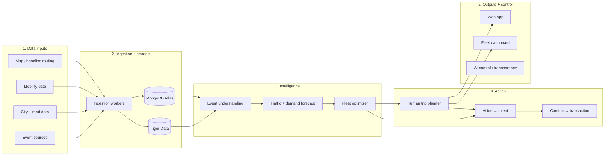

<p align="center">
  <picture>
    <source media="(prefers-color-scheme: dark)" srcset="web/public/wordmark-dark.svg">
    
  </picture>
</p>

<p align="center"><b>Event-aware routing that plans the whole crowd, not just your car.</b><br>
San Francisco · by YoWayMo</p>

<p align="center">
  <a href="https://yowaymo.us">Live app</a> ·
  <a href="https://yowaymo.us/about">About + demo</a> ·
  <a href="ARCHITECTURE.md">Architecture</a> ·
  <a href="#contributing">Contributing</a> ·
  <a href="LICENSE">AGPL-3.0</a>
</p>

---

When the July 4 fireworks end, thousands of cars leave the waterfront at once. Every navigation app routes each driver on its own, so 100 people going from A to B all get the same "fastest" route, and it stops being fast.

**transPEAKtation** sees the crowd coming and routes it together:

- **Knows the events.** Concerts, games, parades and festivals (PredictHQ) plus street closures, permits and incidents (DataSF, Caltrans, CHP), mapped onto the road segments they'll clog.
- **Forecasts the jam.** Live speeds from Mapbox, TomTom and Muni feed an event-conditioned traffic forecast for every road segment.
- **Spreads riders across routes.** It knows where its other riders are headed, so it assigns them to several good routes, each only minutes slower than the fastest, instead of sending everyone down one street.
- **Explains itself.** Each route card says, in plain language, why it was picked (Google Gemini). You can also just say where you're going (ElevenLabs voice).
- **Rewards the detour.** Take the recommended route and get a small reward in devnet SOL. Riders never sign or spend anything.
- **Respects privacy.** Trips are logged at area level (~100 m), not linked to the rider, and you can turn logging and AI off.

Try it at **[yowaymo.us](https://yowaymo.us)**, or watch the one-minute simulation at **[yowaymo.us/about](https://yowaymo.us/about)**.

## How it works



| Folder | What it is | Stack |
|---|---|---|
| [`ingest/`](ingest) | Pulls events, closures, traffic and the road graph; normalizes onto OSM road segments and writes the databases | Python, MongoDB Atlas, Tiger Data (TimescaleDB) |
| [`ml/`](ml) | Traffic + demand forecasting, the crowd load balancer, RL route selection research | Python, PyTorch, SUMO |
| [`api/`](api) | Places, traffic-aware routes, trip planning (`/plan`), voice, route rewards | FastAPI, Mapbox / OSRM, OSMnx, Solana |
| [`web/`](web) | The trip planning app (desktop + mobile layouts) and the `/about` page | Next.js, React, TypeScript, Leaflet |
| [`ios/`](ios) | SwiftUI shell that runs the web app's mobile layout | SwiftUI, WebKit |
| [`demo/`](demo) | Standalone one-minute simulation of July 4 in San Francisco | HTML, canvas |
| [`contracts/`](contracts) | The data shapes shared between folders | JSON Schema, SQL |
| [`deploy/`](deploy) | The DigitalOcean droplet: Caddy, systemd, redeploy on green `main` | Caddy, systemd |

The full picture is in [`ARCHITECTURE.md`](ARCHITECTURE.md). Data store schemas and conventions are in [`AGENTS.md`](AGENTS.md).

## Quick start (no keys needed)

You need **Git**, **Node 18+** and **Python 3.10+**.

**1. The demo** (about 10 seconds):

```bash
git clone https://github.com/No-Way-Mo/transpeaktation.git
cd transpeaktation
node demo/check.mjs      # runs the simulation headlessly, ends with "ok"
open demo/index.html     # Windows: start demo/index.html
```

**2. The API** (in one terminal):

```bash
cd api
python3 -m venv .venv
.venv/bin/pip install -e '.[test]'                    # Windows: .venv/Scripts/pip
.venv/bin/uvicorn app.main:app --reload               # http://localhost:8000/docs
```

**3. The web app** (in another):

```bash
cd web
npm install
npm run dev              # http://localhost:3000
```

Without any keys everything still works: routes come from the free OSRM + Nominatim services, events are demo data, and route notes use template text. The API's `/health` and each `/plan` response say which inputs were live. Add keys (below) to switch each piece to live data.

A wide window shows the desktop layout. Make it 760px or narrower, or open it on a phone, for the mobile layout.

## Full setup

### Tools

| Tool | Needed for | macOS | Windows |
|---|---|---|---|
| Git | everything | `xcode-select --install` | [git-scm.com](https://git-scm.com) (use **Git Bash** for the commands here) |
| Node 18+ | demo, web | `brew install node` | [nodejs.org](https://nodejs.org) |
| Python 3.10+ | ingest, ml, api | `brew install python` | [python.org](https://www.python.org/downloads/) (tick "Add to PATH") |
| mongosh | checking MongoDB | `brew install mongosh` | [mongodb.com/try/download/shell](https://www.mongodb.com/try/download/shell) |
| psql | checking Tiger Data | `brew install libpq`, then `export PATH="$(brew --prefix libpq)/bin:$PATH"` | [postgresql.org/download](https://www.postgresql.org/download/windows/) (command line tools only) |
| Xcode 16+ | iOS app (macOS only) | App Store | — |

### Set up secrets

Every folder has a `.env.example`. Copy each one to `.env`, which is gitignored. Never commit it.

```bash
for d in ingest ml api web; do cp -n $d/.env.example $d/.env; done
```

Every key is optional and each one has a comment saying where to get it. Add only what the part you're working on needs:

| Key | Unlocks | Without it |
|---|---|---|
| `MAPBOX_TOKEN` | Live-traffic routes and place search; `ingest`'s speed polling | OSRM + Nominatim, no traffic |
| `DATASF_APP_TOKEN` (ingest) | A higher DataSF rate limit | DataSF throttles by IP |
| `PREDICTHQ_TOKEN` (ingest) | Events and venues (`python -m pull predicthq_events`) | No events stored; the API shows demo events |
| `SF511_API_KEY` (ingest) | 511.org traffic events and Muni vehicle positions | Those sources are skipped |
| `GEMINI_API_KEY` | Plain-language route notes | Template text |
| `ELEVENLABS_API_KEY` | Voice requests | The mic button returns an error |
| `SOLANA_TREASURY_KEY` | Route rewards (devnet only; `python -m app.rewards keygen`) | No reward offers |
| `MONGODB_URI`, `TIGER_DATABASE_URL` | Stored events, closures, traffic and forecasts | Demo data, no trip log |

**Databases.** To run with real data, create your own free **MongoDB Atlas** cluster and a **Tiger Data** (TimescaleDB) service, and put both connection strings in `.env`. Keep the double quotes around the URLs, because they contain `&`. Then create the schema and indexes:

```bash
psql "$TIGER_DATABASE_URL" -f contracts/tiger_schema.sql
cd ingest && .venv/bin/python -m worker bootstrap     # after the ingest setup below
```

What each collection and table holds: [`AGENTS.md`](AGENTS.md) → Data stores. Core team members: use the shared databases instead (`AGENTS.md` → Team setup).

Check both connections:

```bash
set -a; . ingest/.env; set +a
mongosh "$MONGODB_URI" --quiet --eval 'db.getCollectionNames().sort().join(", ")'
psql "$TIGER_DATABASE_URL" -Atc "SELECT string_agg(hypertable_name, ', ' ORDER BY hypertable_name) FROM timescaledb_information.hypertables"
```

### Ingest

```bash
cd ingest
python3 -m venv .venv
.venv/bin/pip install -e '.[osm,db]'                  # Windows: .venv/Scripts/pip install -e .[osm,db]
.venv/bin/python -m unittest discover -s tests -t .
.venv/bin/python -m pull                              # all sources, ~1 min → ingest/data/raw/*.json
.venv/bin/python -m pull.check                        # data-quality report
.venv/bin/python -m worker bootstrap                  # schema, indexes, road segments → databases
```

Live speed polling: `pip install -e '.[live]'`, then `python -m pull.poll` (every 10 min until Ctrl+C; `--once` for a single pass). Load what it collects with `python -m worker run traffic`. Expect `sf511_*` to say `skip` without a 511 key, and `chp_incidents` freshness to FAIL when CHP's own feed is stale; both are normal. More: [`ingest/DESIGN.md`](ingest/DESIGN.md), [`ingest/TODO.md`](ingest/TODO.md).

### API

`GET /plan?from=lon,lat&to=lon,lat[&depart_at|arrive_by=ISO]` is what the web app calls. It returns candidate routes plus the events, closures, live traffic and forecasts stored for their road segments, and the pick, its explanation and a better departure time. Each request is logged to Mongo `trips` (area-level, no user identity) unless `save=false`; `ai_text=false` keeps trip facts away from Gemini. The web app's AI & privacy settings control both.

Other endpoints: `GET /events`, `GET /places?q=`, `GET /routes`, `GET /health`. Interactive docs: http://localhost:8000/docs. The first start downloads the SF road graph (~15 s) into `api/data/`; until then `/health` shows `road_graph: loading`.

Tests: `cd api && .venv/bin/python -m unittest discover -s tests -t .`

### ML

Forecasting, the crowd load balancer and RL route selection live in [`ml/`](ml). Setup and every stage's command: [`ml/README.md`](ml/README.md) and `AGENTS.md` → Run. Without it, the API uses its own heuristic to pick routes.

### Web app

```bash
cd web
npm install
npm test
npm run dev              # http://localhost:3000
```

The API address defaults to `http://localhost:8000`; set `NEXT_PUBLIC_API_URL` in `web/.env` to change it. To replay a past day with the traffic and closures stored for it: `NEXT_PUBLIC_REPLAY=1 npm run dev`.

### iOS app

The iOS app is a SwiftUI shell around the web app's mobile layout, so **start the API and the web app first**.

```bash
open ios/Transpeaktation.xcodeproj   # pick an iPhone simulator, press Run (⌘R)
```

- The app loads `http://localhost:3000`, which works in the Simulator. On a real iPhone, set `WEB_APP_URL` in `ios/project.yml` to your Mac's LAN address (same Wi-Fi) or a deployed URL, then run `cd ios && xcodegen` (`brew install xcodegen`).
- If the web app isn't running, the app shows "Can't reach transPEAKtation" with Retry.
- Debug the page inside the app: Safari → Develop → Simulator → localhost.

### Troubleshooting

| Symptom | Fix |
|---|---|
| mongosh hangs, then `Server selection timed out` | Your IP isn't on the Atlas access list. IPs change on new Wi-Fi. |
| `bad auth` / `password authentication failed` | Wrong password, or `<password>` still in `.env`. |
| `. ingest/.env` prints `command not found` or runs in the background | A URL lost its double quotes; put them back. |
| `psql: command not found` on macOS | Run the `export PATH=...libpq...` line from Tools (add it to `~/.zshrc`). |
| `osm_drive_graph ... skip: needs osmnx` | You ran the system `python` instead of `.venv/bin/python`. |
| Web app says "Couldn't load routes." | The API isn't running; check http://localhost:8000/health. |
| iOS app stuck on "Can't reach transPEAKtation" | `npm run dev` isn't running in `web/`, or on a real iPhone `WEB_APP_URL` still says `localhost`. |
| `CERTIFICATE_VERIFY_FAILED` to overpass-api.de (Windows) | `.venv/Scripts/pip install certifi`; the pullers use it automatically. |

## Contributing

Contributions are welcome: bug reports, ideas, docs and code.

1. **Start with an issue** for anything bigger than a small fix, so we can agree on the approach before you write it.
2. **Fork and branch** per task, named `<folder>/<short-desc>` (e.g. `web/route-card-a11y`, `ingest/sfmta-feed`).
3. **Keep PRs small** and focused on one folder. Folders talk to each other only through [`contracts/`](contracts) and HTTP/databases, never by importing another folder's code. A change to `contracts/` goes in its own PR.
4. **Run the tests** for what you touched. CI runs all of them on every PR:

   | Folder | Test |
   |---|---|
   | `api/` | `cd api && .venv/bin/python -m unittest discover -s tests -t .` |
   | `ingest/` | `cd ingest && .venv/bin/python -m unittest discover -s tests -t .` |
   | `web/` | `cd web && npm test && npm run build` |
   | `demo/` | `node demo/check.mjs` |
   | `ml/` | see `AGENTS.md` → Run |

5. **Never commit secrets.** New keys go in that folder's `.env.example` with a comment on where to get them.
6. **Match the code around you**: its naming, comment style and structure. [`AGENTS.md`](AGENTS.md) has the project conventions (they're also what AI coding agents read).

A green merge to `main` deploys automatically to [yowaymo.us](https://yowaymo.us).

By submitting a pull request, you agree that your contribution is licensed under the project's license (AGPL-3.0).

## License

transPEAKtation is licensed under the **GNU Affero General Public License v3.0**; see [`LICENSE`](LICENSE).

You're free to use, study, modify and share it. If you distribute it, **or run a modified version as a network service**, you must make your complete source code available under the same license. That keeps the project and every improvement to it open.

Data and third-party services keep their own terms: OpenStreetMap data is © OpenStreetMap contributors (ODbL), and the Mapbox, TomTom, PredictHQ, 511.org, Esri, Google Gemini and ElevenLabs services require your own accounts and follow their providers' terms.
