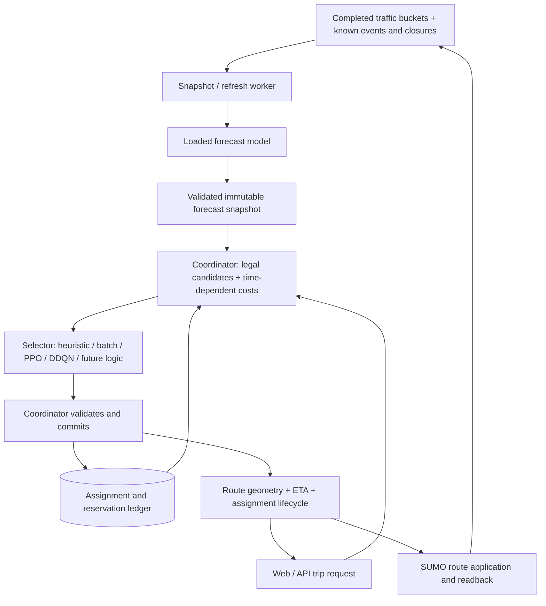

# Model serving → modular routing → SUMO demonstration → DigitalOcean deployment

Implementation handoff for Claude. Inspected against the local code on 2026-09-26. This document is a plan; creating it did not deploy services, launch training, or provision compute.

## 1. Deliverable and deployment order

Deliver a working chain in which a trained traffic model supplies time-dependent road costs, a coordinator generates legal route alternatives, a replaceable selector distributes participating trips, and the accepted routes feed back into the demonstration's traffic state. Expose it through the existing API and web application on DigitalOcean.

Start with the best validated available forecaster and the heuristic selector. Enable batch, PPO and DDQN through configuration after their artifacts and checks pass. Do not wait for long-horizon retraining to finish the serving infrastructure. Add the 3-hour model as a separate release when validated; 5 hours uses the same mechanism. A policy being loadable is not evidence that it reduces congestion.

Scope includes forecast packaging, refresh, coordinator modularity, API integration, assignment lifecycle, a SUMO demonstration, evaluation, deployment and rollback. Long-horizon data generation/training remains in `LONG_HORIZON_RETRAINING_PLAN.md`; benchmark methodology remains in `LOAD_BALANCING_BACKTEST_PLAN.md`. Inspect current code first: implementations are changing, and some older README statements are stale. Do not overwrite contributors' work or reimplement completed pieces.

Follow repository ownership: ML implementation in `ml/`; coordinate API/web changes with their owners; shared HTTP schemas in a separate small `contracts/` change and notify the team. Deployment scripts belong in the existing `deploy/` folder. Use folder-specific branches. The current request is a handoff for later implementation/deployment, not a request to run cloud jobs in this planning session.

## 2. Architecture



The selector chooses among candidates; it does not own road legality, forecasts, data normalization, database writes or vehicle control. The coordinator is the only reservation writer. Every method sees the same candidate-generation rules and ledger semantics.

Keep two independent release choices:

- **Forecaster release:** checkpoint, graph, normalization, feature schema, history length, forecast horizon, evaluation evidence.
- **Selector release:** algorithm, parameters, optional learned weights, observation/action schema, compatibility evidence for the active forecaster.

Record both identities for every decision. Replacing one must not silently replace the other.

## 3. What exists and what must be connected

| Area | Observed implementation | Required work |
|---|---|---|
| Forecast inference | `forecast/predict.py:Predictor` loads model once; produces forecast and exact closure table | Package all runtime artifacts; eliminate machine-specific artifact paths |
| Forecast HTTP | `forecast/serve.py`, `/v1/health`, `/v1/forecast`, bearer token for non-local binding | Dynamic horizon metadata, closure transport, readiness, bounded requests and a real refresh consumer |
| Promotion | `forecast/serving.py`, content-addressed copied checkpoint and history | Atomic pointer update; full release manifest; explicit evaluation evidence; restart/activate loaded model deliberately |
| Forecast routing store | `coordination/forecast_store.py`, immutable snapshots, validation, last-good retention | Feed new snapshots continuously, test H=6/18/30, restart from last-good artifact |
| Coordinator | Candidates, route timing, assignment lifecycle, SQLite-backed ledger, fallback | Deployment config, private service protection, single-writer enforcement, periodic expiry |
| Selectors | `Selector.select(SelectionContext) -> SelectionResult`; forecast_only/heuristic/batch/rl | Registry with capabilities and typed settings; remove method-name special cases; controlled reload |
| RL | PPO/DDQN loaders, shared feature encoder, checkpoint metadata | Verify actual trained artifacts; stronger forecaster compatibility checks; transfer benchmark |
| Public API | `api/app/ml.py` calls `ML_URL/decide` using provider candidates | New explicit coordinated-routing HTTP adapter; this is not the coordinator's existing API |
| DigitalOcean files | `deploy/` has Caddy, systemd, build and redeploy scripts | Add ML services, artifact installation and health-gated release/rollback |
| SUMO benchmark | Interactive environment, forecast bridge, benchmark/backtest runners | Reuse mechanics for demonstration; connect same service/selector behavior and verify route application |

Specific blockers found:

1. `forecast/serve.py:health()` advertises `[10,20,30,40,50,60]` regardless of checkpoint.
2. Forecast HTTP currently returns closure **count**, but not the exact closure table. Its Parquet response contains only the forecast table. Routing requires the closure intervals too.
3. `coordination/rl/forecast_bridge.py:refresh()` passes literal `6` to validation; `ForecastCfg.horizons` also defaults to 6.
4. `coordination/runtime.py:build()` loads a forecast file and defaults to an issued-time replay clock. A live deployment must explicitly use wall time; a SUMO run needs its own simulation clock.
5. `coordination/service.py` enables batching only when `selector_name == "batch"`, accepts selector overrides, and accepts a refresh filesystem path. It currently has no authentication or request-size bound.
6. `coordination/rl/checkpoint.py` records forecaster identity, but its compatibility check does not enforce that identity.
7. `coordination/coordinator.py:_context()` summarizes future reservations over a fixed hour. Preserve that meaning for existing RL weights.
8. `deploy/tp-redeploy` currently rebuilds/restarts API/web/ingest only. It does not install ML artifacts or restart ML services.
9. `Predictor` requires the dataset graph directory and manifest in addition to the `.pt` checkpoint. Uploading only `best.pt` is insufficient.

## 4. Package portable, verifiable artifacts

Add an ML release builder and verifier, for example `ml/deployment/package.py` and `verify.py`, with CLI commands documented after implementation. These filenames/commands are proposed, not existing functionality.

Produce an immutable release directory:

```text
release.json
forecast/model.pt
forecast/graph/...
forecast/manifest.json
network/...                      # canonical roads, legal arcs, crosswalk and required geometry
selectors/<policy-id>/...         # only selected, verified policy artifacts
configs/...
checksums.json
evaluation/summary.json
```

The manifest includes release ID, Git commit, Python/runtime lock identity, checkpoint SHA256, model/network/dataset versions, road-order hash, feature/normalization versions, history_steps, horizon_steps, bucket_min, selector versions and compatible observation/action schemas. Include forecast validation decision and route-transfer evaluation IDs. Record synthetic training and input provenance accurately. Do not invent confidence intervals or an uncertainty score.

Trace all artifact reads in `Predictor`, graph loading and `RoadNetwork.from_artifacts()`. Include exactly their required graph/network/static dependencies; do not copy entire training caches, raw scenario exports or secrets. Use a runtime artifact root rather than changing training metadata or relying on Windows paths. Rebuild machine-local pickle caches on Linux from trusted assets instead of distributing stale path-based caches.

Verify the bundle in a clean directory with no original dataset tree available. Compare the packaged forecast with the source forecast on a fixed golden input, allowing stated numerical tolerance across hardware. Reject incompatible graph order, feature schema, missing assets or wrong checksums before activation. Use only trusted checkpoint artifacts.

Keep at least the previous known-good release and its compatible forecast/selector configuration. A release with no promotion evidence is not automatically validated merely because the existing promote command accepts it. Never use `--force` to disguise a failed model as promoted.

## 5. Forecast serving and automatic refresh

### 5.1 Make model serving horizon-aware

Reuse the existing server and `Predictor`; no new model framework is needed. Derive advertised horizons and input history from the loaded checkpoint. Return the loaded checkpoint identity, not just the pointer on disk.

Add liveness and readiness semantics. Ready means model, graph and normalization loaded, self-check passed and required input schema known. Routing readiness additionally requires a fresh usable snapshot. Keep large model/network diagnostics on private endpoints.

Define a versioned forecast bundle response containing metadata, forecast rows and **exact closures**. Support compact binary transport for citywide snapshots instead of repeatedly converting all roads × horizons to public JSON. One practical implementation is a private bundle archive containing forecast Parquet, closures Parquet and metadata; prohibit unsafe archive paths when unpacking. An empty closure table is still explicit. Do not infer exact closure times back from averaged forecast buckets.

Bound body sizes, inference queue length, request duration and concurrency based on profiling. One model instance and one forward pass at a time is acceptable for the first deployment. Road/horizon response filtering currently happens after full inference: do not treat that filtering as a compute optimization.

### 5.2 Add the missing refresh worker

Proposed module: `ml/forecast/refresh.py`. Run once per newly completed 10-minute bucket, with bounded retry/backoff and deduplication by input issue time + forecaster release + context revision.

Flow:

1. Obtain the last six **completed** normalized history buckets (derive count from checkpoint), ordered over canonical roads. Read only events/closures known as of issue time.
2. Build the exact predictor input schema. Validate units, UTC timestamps, road mapping and source provenance. Preserve training missingness/normalization rules.
3. Call the loaded forecaster once, obtain forecast + closure bundle, validate network identity and horizon completeness.
4. Write to a temporary versioned snapshot directory, fsync as appropriate, then atomically rename/publish the completed bundle. Publish an immutable ID, never a partially written Parquet file.
5. Notify the coordinator via its private authenticated refresh operation. It validates before swapping and re-times live reservations using existing coordinator logic.
6. Record success/failure, model identity, issue time, input coverage and refresh latency. Keep last-good snapshot until its normal staleness limit; do not keep it indefinitely by rewriting timestamps.

For a local shared host the coordinator can load the published file bundle. Replace arbitrary client-supplied paths with an allowlisted snapshot ID resolved strictly under the configured spool directory. Reject traversal and symlink escapes. For a separate host, transfer and verify the bundle before publishing; do not expect one host's filesystem path to exist on another.

### 5.3 Explicit input modes

- `sumo_interactive`: completed measurements from the running controlled simulation; use the same measurement rules as `rl/forecast_bridge.py`. This is the primary evidence-producing demo.
- `replay`: recorded buckets and scheduled context under a replay clock. Good for a reliable UI walkthrough, but route choices cannot change prerecorded future traffic. Label this limitation.
- `live`: normalized Tiger/Mongo inputs through documented contracts. Audit canonical graph coverage, multi-source fusion and event conversion first. Do not average Muni, measured speed and categorical tiles indiscriminately, or fabricate dense coverage. If live inputs are inadequate, report unavailable coverage rather than claim citywide live predictions.

Simulation or replay time must be a first-class session property. All history, event cutoffs, expiry, departures and forecast freshness use that clock. Never relabel a historical scenario as wall-time live traffic.

## 6. Make the load balancer genuinely replaceable

### 6.1 Preserve the existing boundary

Keep `Selector.select(ctx) -> SelectionResult`. Reuse the existing candidate generator, timing, legal masks, deterministic candidate order, detour bounds and coordinator commit checks. A plugin returns request-to-candidate indices plus diagnostics. It must not mutate the ledger, alter the snapshot, reserve routes, read future simulator state or call a second independent route provider.

Represent each selector with a registry entry, proposed `coordination/selectors/registry.py`:

```text
id / implementation_version
factory(validated_settings)
settings_schema
supports_batch
requires_checkpoint
supported_observation_versions
supported_network_versions or validation hook
load_and_validate(release_context)
select(context)
close()
```

Use an explicit registry of installed code, not a public endpoint accepting arbitrary Python paths. Make optional imports lazy so heuristic serving does not require SB3 or OR-Tools. Expose availability/errors in administrative status.

Register `forecast_only`, `heuristic`, `batch`, `rl_ppo` and `rl_ddqn`. Keep `rl` as a backward-compatible alias that resolves a configured checkpoint algorithm. The two named RL entries must check actual checkpoint algorithm identity. Unsupported/missing methods fail configuration preflight; benchmark runs must never silently substitute heuristic output and call it RL.

Generate CLI choices and service validation from the registry rather than maintaining separate name lists. Replace `selector == "batch"` special cases in service, benchmark and config handling with explicit capabilities and scheduler settings. Keep the optimizer and the request batching scheduler independent: a sequential heuristic can run over a batch for fair timing controls.

### 6.2 Separate settings

Introduce a versioned typed routing config, migrating existing YAML keys deliberately. Example **proposed** configuration:

```yaml
runtime:
  clock: wall
  session_id: live
forecast:
  release_id: validated-h18-release
  bucket_min: 10
  horizons: 18
  max_issue_age_min: 20
policy:
  id: heuristic
  settings:
    lam: 60
  fallback: heuristic
  strict: false
scheduler:
  mode: immediate
  max_wait_ms: 250
  max_requests: 32
  queue_limit: 128
ledger:
  db_path: /var/lib/transpeaktation/coordination/live.sqlite
```

Values are starting settings, not tuned optima. Do not paste these keys into the current strict dataclass loader until support/migration exists. Candidate generation, detour limits and ledger budget parameters are separate shared settings, never hidden inside a policy checkpoint. Store their hashes with experiments.

Adding future logic should require **one implementation module, one registry entry, a config and shared conformance tests**. It should not require editing API handlers, database code, SUMO route application or forecasting.

### 6.3 Selection, fallback and deadlines

Validate every returned choice against masks, request IDs and candidate count. Apply existing closure legality and detour rules centrally. Preserve default detour bound: fastest ETA + min(180 seconds, 15% of fastest ETA), unless a separately evaluated config changes it.

For serving, a failed learned/solver selector may fall back to heuristic and must return requested policy, effective policy and reason. If the heuristic also fails, return a structured unavailable response. Stale or invalid forecast is not a reason to label an unrelated provider route coordinated. For benchmarks use strict mode.

The current timeout check after `select()` returns is not an enforceable deadline for a hung implementation. Bound built-in solver runtime, candidate search and queues. Any plugin with unbounded execution must run in an isolated worker that can be terminated; a timed-out thread continues running and is insufficient. Selector workers have read-only context and no commit authority. If computation runs outside the coordinator lock, verify ledger and snapshot versions again before committing, with bounded retry on conflict.

### 6.4 Updating policies without losing reservations

For the first deployment, a controlled coordinator restart is sufficient: persist state, drain admission, stop the old process, start the new configuration, reconstruct live ledger, sweep expirations, verify readiness, reopen admission. Never run two active coordinator processes over the same ledger; SQLite does not make separate in-memory ledgers coherent.

Optional later hot activation: preload and validate a new selector, finish queued batches under their original policy version, atomically change the active selector for new requests, retain ledger and existing assignments. Do not automatically reroute everyone because the selector changed. Existing routes change through explicit reroute or closure handling. Administrative activation is private and audited; ordinary clients cannot select arbitrary experimental algorithms.

## 7. One-hour to three/five-hour model compatibility

1. Derive forecast H from the release and enforce consistency in the server, store, refresh worker, SUMO bridge and routing config. Test H=6, 18 and 30; never extend a shorter model by repeating its final bucket.
2. Keep the existing `rl_obs_v1` shape and normalization when transferring old policies. In particular, `future_load_per_1000` stays a one-hour summary; do not silently make it three hours. Route arrival offset is normalized by one hour, not capped at one hour.
3. New forecast costs and newly available long routes still change the input distribution. Same observation dimension is only structural compatibility.
4. Extend checkpoint/release checks with trained-on forecaster SHA, evaluated-with forecaster SHA(s), horizon, network/road-order identity, candidate-generation settings hash, observation schema and normalization version.
5. A deliberate transfer experiment may run against a new forecast SHA, marked `transfer_unvalidated`. Deployment requires either the original compatible pairing or a saved passing transfer evaluation. Do not block all experimentation merely because hashes differ.
6. Compare frozen old RL + old forecast versus frozen old RL + new forecast on matched common-support scenarios. Also run heuristic with both. Evaluate newly supported departures/long routes separately, so extra coverage is not confused with efficiency gains.
7. If transfer fails, fine-tune the policy with the new forecaster frozen. If introducing hour-2/hour-3 congestion summary features, version observations to `rl_obs_v2` and deliberately migrate/retrain input layers. Do not load old weights blindly.
8. Longer forecasts alone do not create long-term control. For a policy intended to prevent later congestion, include relevant future summaries and episodes/rewards that cover those consequences. This is a separate experiment, not a prerequisite for deploying the present short-trip coordinator.

## 8. Connect the public API and complete the trip lifecycle

### 8.1 Create an explicit shared contract

The current `/decide` interface chooses among Mapbox/OSRM candidates and lacks the coordinator's reservation lifecycle. Do not point `ML_URL` at port 8100 and expect compatibility.

Add `contracts/coordinated_routing.schema.json` plus a short contract document in its own small change. Define versioned request/response types for recommendations and assignment accept/progress/reroute/cancel/complete. Reuse existing coordinator field names where possible:

- request_id, session_id, origin/destination `[lon,lat]`, UTC departure, preview versus reserve;
- assignment_id/version/status/expiry;
- canonical road IDs, exact route geometry, departure/arrival, forecast ETA and extra travel time;
- forecast issue/model/network/release identity and horizon;
- requested/effective selector identity, fallback reason and coordinated status.

Keep measured savings separate from forecasts and allocation scores. Forecast ETA is not observed travel time; a load penalty is not predicted extra seconds.

### 8.2 API adapter

Add `api/app/coordination.py`, using HTTP only, and a `COORDINATION_URL` configuration separate from the legacy `ML_URL`. Add explicit POST routes such as `/routing/recommendations` and `/routing/assignments/{id}/{action}` behind the existing `/api` reverse proxy. Names are proposed until contracts are committed.

Use coordinator geometry directly for coordinated routes. Do not ask Mapbox to regenerate a path through a few waypoints after reservation; the resulting roads may differ from the reserved route. Optional directions can be added only if verified to match the accepted path.

Retain `/plan` for the existing legacy/provider workflow while migrating the demo frontend to the coordinated endpoint. Provider fallback is allowed as an explicit uncoordinated result with no fictitious reservation. Non-driving/unsupported requests remain in the appropriate existing workflow.

Authenticate assignment actions through the API's session/identity mechanism and bind them to the originating session. An assignment ID is not an authorization credential. Reuse the same request_id on network retries; reject conflicting payloads under the same key. If a timeout happens after commit, recover by idempotency lookup/retry instead of creating another reservation. Do not put mutating reservations behind a cacheable GET.

### 8.3 After route selection

1. A preview is read-only and changes no participating load.
2. A request with reserve creates a short provisional reservation (current default 60 seconds).
3. Accept confirms the chosen route, using expected_version. Accepting an alternative revalidates it and swaps reservations atomically.
4. Progress releases road/time cells already traversed. Reroute replaces only remaining load and rechecks closures.
5. Cancel or complete releases remaining reservations idempotently.
6. A periodic expiry task runs even with no incoming traffic. Restart recovery reconstructs unexpired assignments from durable storage.
7. Persist actual selector/release identity on the assignment; later queries must not mislabel it with the current global policy.

If GPS or SUMO progress is unavailable, use explicit completion/cancellation plus configured expiry; do not fabricate observed progress. The coordinator can only account directly for participating assigned vehicles. Background traffic is represented through measurements/forecasts, not imaginary reservations for every car in SF.

### 8.4 Small frontend changes

Use the owner-approved API contract to show route/ETA, alternatives, acceptance and cancellation. Display input mode, forecast age/horizon, effective policy and degraded state in a compact demo status panel. Show predicted congestion separately from measured simulation traffic. Never expose tokens or allow an arbitrary public policy override. Existing UI layout can remain; avoid a redesign.

## 9. SUMO demonstration and evidence

Run SUMO headless on compute; the laptop may display a local SUMO GUI or the web app may render simulation telemetry. A GPU is not needed to render the server-side simulation.

Reuse `coordination/rl/sumo_env.py`, scenario manifests, measurement logic, legal edge mapping and route-application/readback checks. Introduce a small routing-client boundary with in-process and HTTP implementations so the demo can exercise the deployed coordinator without duplicating routing logic. Preserve a fast in-process benchmark path and prove parity on a deterministic fixture.

Each demo session needs its own coordinator/ledger/snapshot namespace and controlled clock. A single isolated demo instance is sufficient initially; do not mix scenario-time reservations into the live ledger. Warm the required observed history, publish the initial forecast, then release the same predefined trip demand. At each action:

1. Request/reserve/accept the selected route.
2. Map canonical roads to legal SUMO edges from the versioned crosswalk.
3. Apply the route and read back what SUMO accepted. Record rejection or discrepancy; release/correct its reservation rather than pretending the route was followed.
4. Send progress/completion. At each completed 10-minute bucket, refresh forecasts from **that session's actual traffic**.
5. Publish bounded telemetry for the dashboard: simulation time, observed congestion, forecast congestion, arrivals, unfinished vehicles and selected policy. Decimate vehicle positions if bandwidth is excessive.

Never use a prerecorded forecast from the baseline for all closed-loop policies. That would prevent forecast feedback from reflecting routing decisions. A replay visualization is useful but cannot establish congestion reduction.

Benchmark ladder:

- Contract/parity smoke test, then one representative scenario with repeated seed for determinism and restart checks.
- Screen forecast_only, heuristic, batch and available PPO/DDQN using equal demand, participation/compliance, warm state, horizon and route constraints. Include batch waiting in travel-time accounting and use equal-timing controls.
- Select on development/validation scenarios only; run the frozen winner and declared challenger on held-out scenarios using the existing backtest plan.
- Report total vehicle-hours/delay including background traffic, completed throughput, unfinished/censored vehicles, participant and background travel times, detour distribution, residential exposure, route changes, fallback rate, forecast age and service p50/p95 latency.

Use strict completion and route-readback validity gates already present in the current benchmark code; audit rather than weaken them. Keep failed and incomplete runs visible. Pair by scenario/family/seed; do not treat thousands of roads as independent experiments. Different policies on the same live road network interfere, so offline paired simulations are the primary causal comparison; ordinary per-user live A/B metrics are not sufficient.

Promotion criteria: zero illegal accepted routes and unexplained reservation/readback mismatches; no hidden fallback in benchmark results; no completion regression disguised as lower mean travel time; demonstrable improvement on the predeclared congestion metric without unacceptable participant/background harm. If no learned policy wins, deploy the validated heuristic and report the result honestly.

## 10. DigitalOcean deployment topology and budget

### 10.1 Build on the existing installation

The repository already has Caddy and systemd files targeting `/opt/transpeaktation`, services under user `tp`, API on localhost:8000 and web on localhost:3000. The checked-in domain is `167-172-23-38.sslip.io`; verify the actual deployment/host before using it. This plan did not inspect the remote host or confirm it is running.

Extend that arrangement. Do not introduce Kubernetes or migrate everything to containers just for this feature.

| Process | Initial placement | Exposure |
|---|---|---|
| Caddy / API / web | Existing app Droplet | HTTPS through Caddy |
| Forecast server | Same host if measured resources allow; otherwise separate inference Droplet | localhost:8200 or restricted private VPC |
| Refresh worker | Near the input source/coordinator; one publisher per session | Private only |
| Coordinator | One process per isolated ledger/session | localhost:8100 or restricted private VPC |
| SUMO / backtests | Separate temporary CPU worker when load is substantial | Private administrative access |
| Model / RL training | Separate temporary GPU/CPU workers if needed | Not on the serving host |

Start CPU inference profiling with a proposed 4–8 vCPU, 16 GiB RAM class of host if a new inference host is needed. This is a test starting point, not measured capacity. Check actual RAM during graph loading and forecast materialization; scale based on results. Existing shared app hosts may have less headroom. Profile several full-city requests and route bursts before selecting size. Do not infer CPU latency from an 18 ms GPU forward pass.

If inference misses the refresh budget, consider a single NVIDIA GPU Droplet after checking regional availability, VRAM and credit eligibility. Serving a forecast every ten minutes does not automatically require an always-on training GPU. SUMO parallelism is usually a separate CPU decision.

Use localhost when colocated. Across hosts use DigitalOcean VPC plus firewall rules and authenticated private services; private networking alone does not authenticate a caller. Expose only HTTPS and restricted administrative SSH publicly. [DigitalOcean VPC](https://docs.digitalocean.com/products/networking/vpc/details/features/) and [Cloud Firewalls](https://docs.digitalocean.com/products/networking/firewalls/).

### 10.2 Keep the $200 credit useful

Treat the earlier $200 as an upper planning envelope, not a verified remaining balance. Check remaining credits, expiration, applicable services and existing spend before provisioning. Price the actual region/size from the current catalog; record hourly rate, planned lifetime and teardown date.

Suggested allocation if the full credit remains: $40 serving/demo, $90 bounded simulation/benchmark runs, $40 optional training/transfer work and $30 reserve. These are spending envelopes, not provider quotes or promises that every experiment fits. Defer optional RL adaptation if the measured cost exceeds its envelope.

Estimate total = serving hours × rate + simulation node-hours × rate + GPU hours × rate + storage/backup/transfer charges. Set spend alerts and job runtime limits. Back up artifacts before destroying temporary workers; do not delete the app host or its ledger as part of worker cleanup. Powered-off bundled CPU and GPU Droplets continue billing; shutdown alone does not end their charges. [DigitalOcean pricing and billing](https://docs.digitalocean.com/products/droplets/details/pricing/).

## 11. Deployment implementation and rollout

### 11.1 Files to add or extend

| Location | Work |
|---|---|
| `ml/deployment/` | Portable bundle builder, verifier, release status and smoke test |
| `ml/forecast/serve.py`, `serving.py`, new refresh module | Dynamic metadata, closure bundle, atomic promotion, scheduling and readiness |
| `ml/coordination/selectors/` and config | Registry, settings validation, capabilities, selector lifecycle |
| `ml/coordination/service.py`, runtime | Authentication, bounded input/queue, snapshot-ID refresh, clock selection, availability |
| `ml/coordination/rl/checkpoint.py`, `forecast_bridge.py` | Explicit transfer compatibility and generic horizons |
| `ml/coordination/benchmark/` | Use shared registry/scheduler; record complete release identities |
| `contracts/` | Shared forecast/route/lifecycle schemas in a separate change |
| `api/app/coordination.py`, API routes | HTTP adapter, ownership/idempotency, lifecycle and explicit fallback |
| `web/` | Minimal coordinated-route flow and session telemetry |
| `deploy/tp-forecast.service` | Load one pinned forecast release, private bind |
| `deploy/tp-forecast-refresh.service` | Continuous bucket watcher with retry; run only one per session |
| `deploy/tp-coordination.service` | Single writer, durable ledger, explicit clock and pinned config |
| `deploy/tp-sumo-demo.service` | Optional isolated demo runner, bounded resources |
| `deploy/build.sh`, `tp-redeploy`, provisioning | ML dependencies, artifact installation, scoped restart, health gates and rollback |
| `deploy/README.md` | Exact initial install, update, switch-selector, rotate-token, backup and rollback commands |

Pin and test Linux runtime dependencies. Existing `ml/pyproject.toml` base dependencies include SUMO even though some comments call coordination lightweight; audit actual installs. Use existing tested NumPy/Torch/SB3/OR-Tools constraints and a reproducible lock/constraints file. Do not upgrade NumPy transitively and discover solver incompatibility on the demo host. Separate serving and training environments if that simplifies dependencies.

Use systemd EnvironmentFile entries for service secrets, restrictive file permissions, persistent state under `/var/lib/transpeaktation`, and immutable artifacts outside Git-controlled source. Never bake tokens into units, URLs or artifacts. Preserve the existing privacy choice to avoid raw coordinate/IP access logs; use request/session identifiers and aggregate metrics instead.

### 11.2 Rollout sequence

1. Inspect actual host resources, existing service definitions, disk space, current artifact identity, database connectivity and credit balance. Do not print secret values.
2. Build a release locally/on CI, run tests and verify its artifact bundle; transfer into an inactive release directory and verify hashes on host.
3. Install locked ML dependencies and service units without interrupting the current app. Start the candidate forecast service on an alternate private port; run golden inference and readiness checks.
4. Produce a valid fresh initial snapshot from the selected input mode. Run coordinator smoke checks on a **separate test ledger** with no production reservations.
5. Enable the refresh loop; observe at least two successive bucket publications or equivalent accelerated simulation cycles. Verify monotonic issue times and correct model/network identities.
6. Put the coordinator through restart recovery, expiry, duplicate request and route legality checks. Activate it with a validated default selector, normally heuristic initially.
7. Switch the API to the coordinated flow under a feature flag, then enable the web demonstration. Test over public HTTPS, including accept/cancel/complete and explicit fallback.
8. Record live readiness, versions, resource usage, smoke results and exact rollback procedure in the deployment report.

The serving pointer alone does not hot-reload an already constructed `Service`. Either perform a controlled restart or implement explicit preload-and-swap. Upgrade forecast horizon, routing expectations and selected-policy compatibility as one release transaction; do not briefly route H=18 data through an H=6 store.

Modify redeploy so failures do not restart unrelated services or replace working artifacts. Stage code/runtime/artifacts, verify first, then switch pointers. For coordinator replacement, drain and stop the old writer before starting the new writer on the durable ledger. Use SQLite's supported backup mechanism for a live backup, or stop cleanly before copying all required database files; copying only the main file in WAL mode is unsafe.

Rollback restores previous code/runtime, model bundle and compatible routing/selector config. Preserve active assignment state and revalidate remaining routes. A rollback to a shorter horizon may no longer support some existing future trips; mark/replan those explicitly instead of silently truncating reservations. Keep database changes backward-compatible for the initial rollout.

## 12. Required verification

### Module and contract tests

- All selectors pass one conformance suite: valid masked choices, deterministic seeded behavior where intended, no mutation of input snapshot/ledger, declared settings and unavailable-checkpoint handling.
- Registry resolves service, CLI and benchmark names identically; scheduling depends on capabilities/config, not a magic selector name.
- Forecast HTTP returns exact closures, dynamic H and loaded checkpoint identity; reject malformed/oversized inputs.
- Artifact bundle loads with no training tree and matches golden forecast values.
- H=6/18/30 snapshot publication, last interval boundaries, road ordering and closure clearance work correctly.
- Old RL schema remains unchanged; incompatible policies fail; deliberate transfer is labeled and requires evidence for promotion.
- Cross-folder HTTP schemas pass consumer/producer contract tests.

### Integration and recovery tests

- Two sequential same-OD reservations see prior participating load; selection need not always differ, but ledger state must affect the score correctly.
- Preview changes no ledger state; duplicate retry commits once; cancel/complete release once; stale expected_version is rejected.
- Accepting another candidate and rerouting swap remaining load atomically.
- Selector switch/restart retains active reservations; a second active writer is prevented.
- Refresh failure preserves last-good until stale; stale snapshot stops coordinated routing or explicitly degrades according to contract.
- Closed road never appears in an accepted traversable schedule; out-of-coverage routes are explicit.
- Replay/SUMO clocks cannot leak into live sessions; future measurements cannot enter history.
- SUMO readback matches the committed path or produces a visible handled failure.
- API timeout-after-commit recovers the same assignment; unauthenticated/wrong-session lifecycle actions fail.
- Warm restart and rollback are rehearsed using a test ledger, including a horizon downgrade case.

### Measured operational gates

Proposed demo budgets, to confirm on target hardware: a full snapshot refresh in under 60 seconds at a 10-minute cadence; interactive single-route p95 below 2 seconds at the agreed test load; bounded batching wait included in reported latency; memory leaves headroom for concurrent app services. If these fail, profile candidate search, serialization, inference and contention separately before buying larger hardware. Report measurements, not only a passing health endpoint.

## 13. Ordered action checklist for Claude

1. [ ] Audit current implementations and artifacts; record what already passes. Do not assume remotely trained RL checkpoints are present locally.
2. [ ] Define shared contracts and release/compatibility manifest; coordinate folder ownership.
3. [ ] Implement portable packaging and dynamic forecast/closure serving; verify clean-room loading.
4. [ ] Implement the refresh loop and immutable publication in replay/SUMO mode first; add live source adapter only with verified input coverage.
5. [ ] Refactor selector registry/settings/scheduler while preserving the existing coordinator and ledger invariants.
6. [ ] Add policy compatibility checks and H=6/18/30 bridge/store support.
7. [ ] Add API coordinated routing and lifecycle, then minimal frontend integration.
8. [ ] Connect an isolated SUMO session through the shared routing client, including route readback and observed feedback.
9. [ ] Add systemd units, reproducible dependencies, release install, health gates and rollback to existing deployment scripts.
10. [ ] Profile the intended DigitalOcean hardware, publish cost estimate, then deploy the validated one-hour/heuristic release if the three-hour model is not ready.
11. [ ] Run strict paired selector backtests; activate the winner through configuration with evidence attached.
12. [ ] Evaluate the three-hour forecaster/policy pairing, then promote it atomically; keep a compatible rollback release. Fine-tune RL only if the transfer experiment warrants it.
13. [ ] Produce `ml/reports/deployment_and_routing_acceptance.md` and `deploy/README.md` with exact commands, service URLs, release IDs, tested selectors, fallback behavior, actual timings/cost, known coverage limits and rollback results.

Definition of done: a browser trip can request, accept, follow and complete a coordinated route; its reservation affects later decisions; a running SUMO demonstration feeds its changed traffic back into refreshed forecasts; a new selector can be installed through its module/registry/config without changing forecasting or API logic; deployment survives restart and can roll back; congestion-reduction claims are backed by paired valid runs.
