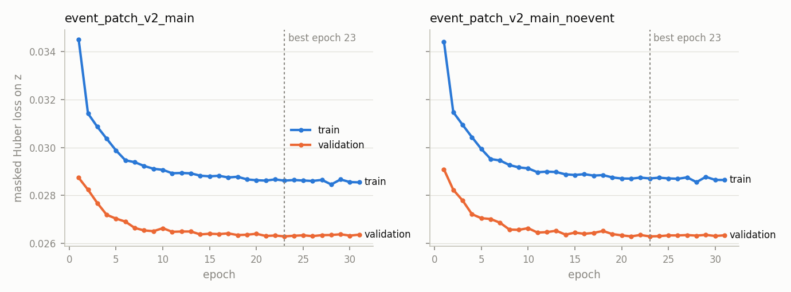

# Forecast experiment report: event_patch_v2_main, event_patch_v2_main_noevent

> **Synthetic.** Trained and evaluated on SUMO scenarios (`sumo_synthetic`) grounded in real SF roads and permits. Demand, attendance and behaviour are scenario assumptions. None of these numbers are validated against measured traffic.

## Training

| experiment | best_epoch | best_val_loss | epochs_run | early_stopped | train_seconds | peak_gpu_mb | parameters |
|---|---|---|---|---|---|---|---|
| event_patch_v2_main | 23 | 0.026 | 31 | yes | 6751.0 | 6724.6 | 372097 |
| event_patch_v2_main_noevent | 23 | 0.026 | 31 | yes | 5901.0 | 3710.1 | 287425 |

## VAL partition: bearrison

### All labelled road-buckets (horizons pooled, equal weight per label)

| system | labels | tt_mae_s | tt_wape | speed_mae_mph | cong_mae | z_mae |
|---|---|---|---|---|---|---|
| persistence | 104453729 | 3.831 | 0.230 | 2.841 | 0.112 | 0.200 |
| event_patch_v2_main | 104453729 | 2.538 | 0.153 | 1.754 | 0.069 | 0.128 |
| event_patch_v2_main_noevent | 104453729 | 2.532 | 0.152 | 1.748 | 0.069 | 0.128 |

### By horizon

| horizon_min | system | labels | tt_mae_s | tt_wape | speed_mae_mph | cong_mae | z_mae |
|---|---|---|---|---|---|---|---|
| 10 | persistence | 17484437 | 3.793 | 0.228 | 2.832 | 0.111 | 0.199 |
| 10 | event_patch_v2_main | 17484437 | 2.525 | 0.152 | 1.749 | 0.069 | 0.128 |
| 10 | event_patch_v2_main_noevent | 17484437 | 2.519 | 0.151 | 1.743 | 0.068 | 0.127 |
| 20 | persistence | 17461445 | 3.829 | 0.230 | 2.837 | 0.111 | 0.200 |
| 20 | event_patch_v2_main | 17461445 | 2.533 | 0.152 | 1.750 | 0.069 | 0.128 |
| 20 | event_patch_v2_main_noevent | 17461445 | 2.526 | 0.152 | 1.744 | 0.069 | 0.128 |
| 30 | persistence | 17430348 | 3.825 | 0.230 | 2.837 | 0.111 | 0.200 |
| 30 | event_patch_v2_main | 17430348 | 2.537 | 0.153 | 1.752 | 0.069 | 0.128 |
| 30 | event_patch_v2_main_noevent | 17430348 | 2.532 | 0.152 | 1.746 | 0.069 | 0.128 |
| 40 | persistence | 17396160 | 3.842 | 0.231 | 2.844 | 0.112 | 0.200 |
| 40 | event_patch_v2_main | 17396160 | 2.538 | 0.153 | 1.755 | 0.069 | 0.128 |
| 40 | event_patch_v2_main_noevent | 17396160 | 2.532 | 0.152 | 1.749 | 0.069 | 0.128 |
| 50 | persistence | 17360889 | 3.852 | 0.232 | 2.847 | 0.112 | 0.200 |
| 50 | event_patch_v2_main | 17360889 | 2.546 | 0.153 | 1.758 | 0.069 | 0.129 |
| 50 | event_patch_v2_main_noevent | 17360889 | 2.540 | 0.153 | 1.752 | 0.069 | 0.128 |
| 60 | persistence | 17320450 | 3.844 | 0.231 | 2.846 | 0.112 | 0.200 |
| 60 | event_patch_v2_main | 17320450 | 2.551 | 0.153 | 1.760 | 0.069 | 0.129 |
| 60 | event_patch_v2_main_noevent | 17320450 | 2.545 | 0.153 | 1.754 | 0.069 | 0.128 |

### Event vs control run

| with_event | system | labels | tt_mae_s | tt_wape | speed_mae_mph | cong_mae | z_mae |
|---|---|---|---|---|---|---|---|
| no | persistence | 51485999 | 3.831 | 0.231 | 2.883 | 0.113 | 0.202 |
| no | event_patch_v2_main | 51485999 | 2.530 | 0.153 | 1.775 | 0.070 | 0.129 |
| no | event_patch_v2_main_noevent | 51485999 | 2.522 | 0.152 | 1.768 | 0.069 | 0.129 |
| yes | persistence | 52967730 | 3.830 | 0.230 | 2.800 | 0.110 | 0.198 |
| yes | event_patch_v2_main | 52967730 | 2.546 | 0.153 | 1.734 | 0.068 | 0.127 |
| yes | event_patch_v2_main_noevent | 52967730 | 2.542 | 0.152 | 1.728 | 0.068 | 0.127 |

### Event-near (≤ 1000 m of the focal footprint) vs other roads

| with_event | near | system | labels | tt_mae_s | tt_wape | speed_mae_mph | cong_mae | z_mae |
|---|---|---|---|---|---|---|---|---|
| no | no | persistence | 48674201 | 3.769 | 0.227 | 2.879 | 0.113 | 0.201 |
| no | no | event_patch_v2_main | 48674201 | 2.483 | 0.150 | 1.761 | 0.069 | 0.128 |
| no | no | event_patch_v2_main_noevent | 48674201 | 2.475 | 0.149 | 1.755 | 0.069 | 0.127 |
| no | yes | persistence | 2811798 | 4.917 | 0.294 | 2.944 | 0.117 | 0.223 |
| no | yes | event_patch_v2_main | 2811798 | 3.349 | 0.201 | 2.011 | 0.080 | 0.155 |
| no | yes | event_patch_v2_main_noevent | 2811798 | 3.345 | 0.200 | 2.008 | 0.080 | 0.155 |
| yes | no | persistence | 49876155 | 3.740 | 0.225 | 2.814 | 0.110 | 0.197 |
| yes | no | event_patch_v2_main | 49876155 | 2.474 | 0.149 | 1.730 | 0.068 | 0.126 |
| yes | no | event_patch_v2_main_noevent | 49876155 | 2.467 | 0.148 | 1.724 | 0.068 | 0.126 |
| yes | yes | persistence | 3091575 | 5.286 | 0.299 | 2.571 | 0.103 | 0.205 |
| yes | yes | event_patch_v2_main | 3091575 | 3.718 | 0.210 | 1.794 | 0.072 | 0.147 |
| yes | yes | event_patch_v2_main_noevent | 3091575 | 3.745 | 0.212 | 1.802 | 0.072 | 0.148 |

### Event run, event-near roads, by horizon

| horizon_min | system | labels | tt_mae_s | tt_wape | speed_mae_mph | cong_mae | z_mae |
|---|---|---|---|---|---|---|---|
| 10 | persistence | 518327 | 4.936 | 0.279 | 2.477 | 0.099 | 0.196 |
| 10 | event_patch_v2_main | 518327 | 3.663 | 0.207 | 1.768 | 0.071 | 0.145 |
| 10 | event_patch_v2_main_noevent | 518327 | 3.671 | 0.208 | 1.763 | 0.071 | 0.145 |
| 20 | persistence | 517607 | 5.186 | 0.293 | 2.516 | 0.101 | 0.201 |
| 20 | event_patch_v2_main | 517607 | 3.700 | 0.209 | 1.777 | 0.071 | 0.146 |
| 20 | event_patch_v2_main_noevent | 517607 | 3.720 | 0.210 | 1.780 | 0.071 | 0.147 |
| 30 | persistence | 516540 | 5.285 | 0.299 | 2.551 | 0.102 | 0.204 |
| 30 | event_patch_v2_main | 516540 | 3.721 | 0.210 | 1.784 | 0.072 | 0.147 |
| 30 | event_patch_v2_main_noevent | 516540 | 3.754 | 0.212 | 1.796 | 0.072 | 0.148 |
| 40 | persistence | 514979 | 5.393 | 0.305 | 2.597 | 0.104 | 0.208 |
| 40 | event_patch_v2_main | 514979 | 3.730 | 0.211 | 1.797 | 0.072 | 0.147 |
| 40 | event_patch_v2_main_noevent | 514979 | 3.767 | 0.213 | 1.811 | 0.073 | 0.149 |
| 50 | persistence | 513147 | 5.447 | 0.308 | 2.629 | 0.105 | 0.211 |
| 50 | event_patch_v2_main | 513147 | 3.750 | 0.212 | 1.812 | 0.073 | 0.148 |
| 50 | event_patch_v2_main_noevent | 513147 | 3.784 | 0.214 | 1.825 | 0.073 | 0.150 |
| 60 | persistence | 510975 | 5.473 | 0.311 | 2.656 | 0.106 | 0.212 |
| 60 | event_patch_v2_main | 510975 | 3.747 | 0.213 | 1.826 | 0.073 | 0.149 |
| 60 | event_patch_v2_main_noevent | 510975 | 3.773 | 0.214 | 1.836 | 0.074 | 0.151 |

### Severe targets (congestion ≥ 0.5) vs others

| severe | system | labels | tt_mae_s | tt_wape | speed_mae_mph | cong_mae | z_mae |
|---|---|---|---|---|---|---|---|
| no | persistence | 79242211 | 2.694 | 0.173 | 2.694 | 0.105 | 0.158 |
| no | event_patch_v2_main | 79242211 | 1.567 | 0.100 | 1.772 | 0.069 | 0.103 |
| no | event_patch_v2_main_noevent | 79242211 | 1.562 | 0.100 | 1.771 | 0.069 | 0.103 |
| yes | persistence | 25211518 | 7.404 | 0.373 | 3.301 | 0.132 | 0.332 |
| yes | event_patch_v2_main | 25211518 | 5.591 | 0.282 | 1.697 | 0.068 | 0.208 |
| yes | event_patch_v2_main_noevent | 25211518 | 5.581 | 0.281 | 1.677 | 0.067 | 0.207 |

### Per event group and run type

| group | with_event | system | labels | tt_mae_s | tt_wape | speed_mae_mph | cong_mae | z_mae |
|---|---|---|---|---|---|---|---|---|
| bearrison | no | persistence | 51485999 | 3.831 | 0.231 | 2.883 | 0.113 | 0.202 |
| bearrison | no | event_patch_v2_main | 51485999 | 2.530 | 0.153 | 1.775 | 0.070 | 0.129 |
| bearrison | no | event_patch_v2_main_noevent | 51485999 | 2.522 | 0.152 | 1.768 | 0.069 | 0.129 |
| bearrison | yes | persistence | 52967730 | 3.830 | 0.230 | 2.800 | 0.110 | 0.198 |
| bearrison | yes | event_patch_v2_main | 52967730 | 2.546 | 0.153 | 1.734 | 0.068 | 0.127 |
| bearrison | yes | event_patch_v2_main_noevent | 52967730 | 2.542 | 0.152 | 1.728 | 0.068 | 0.127 |

Macro-average over 1 event group(s):

| system | tt_mae_s | speed_mae_mph | cong_mae | z_mae |
|---|---|---|---|---|
| persistence | 3.831 | 2.841 | 0.112 | 0.200 |
| event_patch_v2_main | 2.538 | 1.754 | 0.069 | 0.128 |
| event_patch_v2_main_noevent | 2.532 | 1.748 | 0.069 | 0.128 |

### Congestion build-up detection (declared: target congestion ≥ 0.5 on a road whose issue-time value was < 0.3 or missing)

| horizon_min | system | buildup_positives | buildup_precision | buildup_recall | buildup_f1 |
|---|---|---|---|---|---|
| 10 | persistence | 552341 | – | 0.000 | – |
| 10 | event_patch_v2_main | 552341 | 0.754 | 0.537 | 0.627 |
| 10 | event_patch_v2_main_noevent | 552341 | 0.756 | 0.538 | 0.629 |
| 20 | persistence | 543524 | – | 0.000 | – |
| 20 | event_patch_v2_main | 543524 | 0.756 | 0.546 | 0.634 |
| 20 | event_patch_v2_main_noevent | 543524 | 0.759 | 0.547 | 0.636 |
| 30 | persistence | 541401 | – | 0.000 | – |
| 30 | event_patch_v2_main | 541401 | 0.756 | 0.547 | 0.635 |
| 30 | event_patch_v2_main_noevent | 541401 | 0.759 | 0.548 | 0.636 |
| 40 | persistence | 541254 | – | 0.000 | – |
| 40 | event_patch_v2_main | 541254 | 0.757 | 0.545 | 0.634 |
| 40 | event_patch_v2_main_noevent | 541254 | 0.760 | 0.546 | 0.635 |
| 50 | persistence | 540163 | – | 0.000 | – |
| 50 | event_patch_v2_main | 540163 | 0.756 | 0.546 | 0.634 |
| 50 | event_patch_v2_main_noevent | 540163 | 0.759 | 0.546 | 0.635 |
| 60 | persistence | 537407 | – | 0.000 | – |
| 60 | event_patch_v2_main | 537407 | 0.756 | 0.546 | 0.634 |
| 60 | event_patch_v2_main_noevent | 537407 | 0.758 | 0.546 | 0.635 |

### Coverage

- windows: 1056; target cells (modelled roads × horizons): 167,321,088
- valid labels: 104,453,729 (62.4%); excluded: not observed 62,867,353, closed 226,944 (closures are routing restrictions, not labels)
- roads not modelled (no SUMO edge / merged parallel / no passenger access): 1224 per bucket, never labelled

- `event_patch_v2_main` (best epoch 23): full-city inference 20 ms/window on cuda, peak GPU 634.9 MB
- `event_patch_v2_main_noevent` (best epoch 23): full-city inference 16 ms/window on cuda, peak GPU 332.7 MB

Per-window travel-time MAE: `event_patch_v2_main` lower than `event_patch_v2_main_noevent` in 139/1056 windows (windows overlap in time and share runs; not independent trials).

`event_patch_v2_main` lower than persistence in 1056/1056 windows.
`event_patch_v2_main_noevent` lower than persistence in 1056/1056 windows.

### Counterfactual: `event_patch_v2_main` on event runs with the focal event removed from its context (traffic inputs unchanged)

| near | labels | mean_abs_dz | mean_dz_event_minus_none | tt_mae_with_event | tt_mae_focal_event_removed |
|---|---|---|---|---|---|
| no | 49876155.0 | 0.003 | 0.000 | 2.474 | 2.474 |
| yes | 3091575.0 | 0.026 | 0.017 | 3.718 | 3.755 |

## TEST partition: portola

### All labelled road-buckets (horizons pooled, equal weight per label)

| system | labels | tt_mae_s | tt_wape | speed_mae_mph | cong_mae | z_mae |
|---|---|---|---|---|---|---|
| persistence | 80477313 | 3.481 | 0.214 | 2.778 | 0.108 | 0.190 |
| event_patch_v2_main | 80477313 | 2.330 | 0.143 | 1.741 | 0.068 | 0.123 |
| event_patch_v2_main_noevent | 80477313 | 2.331 | 0.143 | 1.739 | 0.068 | 0.123 |

### By horizon

| horizon_min | system | labels | tt_mae_s | tt_wape | speed_mae_mph | cong_mae | z_mae |
|---|---|---|---|---|---|---|---|
| 10 | persistence | 13525991 | 3.441 | 0.212 | 2.773 | 0.108 | 0.189 |
| 10 | event_patch_v2_main | 13525991 | 2.314 | 0.142 | 1.733 | 0.068 | 0.123 |
| 10 | event_patch_v2_main_noevent | 13525991 | 2.316 | 0.143 | 1.731 | 0.068 | 0.123 |
| 20 | persistence | 13482946 | 3.475 | 0.214 | 2.777 | 0.108 | 0.190 |
| 20 | event_patch_v2_main | 13482946 | 2.321 | 0.143 | 1.736 | 0.068 | 0.123 |
| 20 | event_patch_v2_main_noevent | 13482946 | 2.322 | 0.143 | 1.734 | 0.068 | 0.123 |
| 30 | persistence | 13435381 | 3.474 | 0.214 | 2.777 | 0.108 | 0.190 |
| 30 | event_patch_v2_main | 13435381 | 2.327 | 0.143 | 1.739 | 0.068 | 0.123 |
| 30 | event_patch_v2_main_noevent | 13435381 | 2.328 | 0.143 | 1.737 | 0.068 | 0.123 |
| 40 | persistence | 13388130 | 3.493 | 0.215 | 2.780 | 0.108 | 0.191 |
| 40 | event_patch_v2_main | 13388130 | 2.332 | 0.144 | 1.743 | 0.068 | 0.123 |
| 40 | event_patch_v2_main_noevent | 13388130 | 2.333 | 0.144 | 1.741 | 0.068 | 0.123 |
| 50 | persistence | 13343212 | 3.502 | 0.216 | 2.781 | 0.108 | 0.191 |
| 50 | event_patch_v2_main | 13343212 | 2.340 | 0.144 | 1.747 | 0.068 | 0.124 |
| 50 | event_patch_v2_main_noevent | 13343212 | 2.340 | 0.144 | 1.744 | 0.068 | 0.123 |
| 60 | persistence | 13301653 | 3.500 | 0.215 | 2.781 | 0.108 | 0.191 |
| 60 | event_patch_v2_main | 13301653 | 2.346 | 0.144 | 1.750 | 0.068 | 0.124 |
| 60 | event_patch_v2_main_noevent | 13301653 | 2.346 | 0.144 | 1.748 | 0.068 | 0.124 |

### Event vs control run

| with_event | system | labels | tt_mae_s | tt_wape | speed_mae_mph | cong_mae | z_mae |
|---|---|---|---|---|---|---|---|
| no | persistence | 39692658 | 3.458 | 0.214 | 2.817 | 0.110 | 0.192 |
| no | event_patch_v2_main | 39692658 | 2.299 | 0.142 | 1.760 | 0.069 | 0.124 |
| no | event_patch_v2_main_noevent | 39692658 | 2.298 | 0.142 | 1.757 | 0.068 | 0.124 |
| yes | persistence | 40784655 | 3.503 | 0.215 | 2.741 | 0.107 | 0.189 |
| yes | event_patch_v2_main | 40784655 | 2.360 | 0.145 | 1.724 | 0.067 | 0.123 |
| yes | event_patch_v2_main_noevent | 40784655 | 2.363 | 0.145 | 1.722 | 0.067 | 0.123 |

### Event-near (≤ 1000 m of the focal footprint) vs other roads

| with_event | near | system | labels | tt_mae_s | tt_wape | speed_mae_mph | cong_mae | z_mae |
|---|---|---|---|---|---|---|---|---|
| no | no | persistence | 38840667 | 3.468 | 0.214 | 2.813 | 0.110 | 0.192 |
| no | no | event_patch_v2_main | 38840667 | 2.306 | 0.142 | 1.758 | 0.069 | 0.124 |
| no | no | event_patch_v2_main_noevent | 38840667 | 2.305 | 0.142 | 1.755 | 0.069 | 0.124 |
| no | yes | persistence | 851991 | 3.027 | 0.202 | 3.011 | 0.110 | 0.183 |
| no | yes | event_patch_v2_main | 851991 | 1.978 | 0.132 | 1.846 | 0.067 | 0.115 |
| no | yes | event_patch_v2_main_noevent | 851991 | 1.975 | 0.132 | 1.842 | 0.067 | 0.114 |
| yes | no | persistence | 39692110 | 3.398 | 0.209 | 2.745 | 0.107 | 0.188 |
| yes | no | event_patch_v2_main | 39692110 | 2.268 | 0.140 | 1.721 | 0.067 | 0.122 |
| yes | no | event_patch_v2_main_noevent | 39692110 | 2.266 | 0.140 | 1.719 | 0.067 | 0.122 |
| yes | yes | persistence | 1092545 | 7.297 | 0.371 | 2.592 | 0.097 | 0.205 |
| yes | yes | event_patch_v2_main | 1092545 | 5.695 | 0.290 | 1.804 | 0.068 | 0.154 |
| yes | yes | event_patch_v2_main_noevent | 1092545 | 5.879 | 0.299 | 1.819 | 0.068 | 0.160 |

### Event run, event-near roads, by horizon

| horizon_min | system | labels | tt_mae_s | tt_wape | speed_mae_mph | cong_mae | z_mae |
|---|---|---|---|---|---|---|---|
| 10 | persistence | 180845 | 5.773 | 0.296 | 2.442 | 0.092 | 0.181 |
| 10 | event_patch_v2_main | 180845 | 5.484 | 0.281 | 1.749 | 0.066 | 0.147 |
| 10 | event_patch_v2_main_noevent | 180845 | 5.756 | 0.295 | 1.779 | 0.067 | 0.156 |
| 20 | persistence | 181188 | 6.919 | 0.354 | 2.538 | 0.095 | 0.199 |
| 20 | event_patch_v2_main | 181188 | 5.588 | 0.286 | 1.778 | 0.067 | 0.151 |
| 20 | event_patch_v2_main_noevent | 181188 | 5.801 | 0.296 | 1.796 | 0.067 | 0.157 |
| 30 | persistence | 181519 | 7.355 | 0.375 | 2.579 | 0.097 | 0.205 |
| 30 | event_patch_v2_main | 181519 | 5.648 | 0.288 | 1.792 | 0.067 | 0.153 |
| 30 | event_patch_v2_main_noevent | 181519 | 5.837 | 0.298 | 1.807 | 0.068 | 0.158 |
| 40 | persistence | 182235 | 7.643 | 0.389 | 2.610 | 0.098 | 0.210 |
| 40 | event_patch_v2_main | 182235 | 5.705 | 0.291 | 1.810 | 0.068 | 0.155 |
| 40 | event_patch_v2_main_noevent | 182235 | 5.871 | 0.299 | 1.821 | 0.068 | 0.160 |
| 50 | persistence | 182985 | 7.879 | 0.400 | 2.657 | 0.100 | 0.215 |
| 50 | event_patch_v2_main | 182985 | 5.812 | 0.295 | 1.832 | 0.069 | 0.158 |
| 50 | event_patch_v2_main_noevent | 182985 | 5.957 | 0.302 | 1.842 | 0.069 | 0.162 |
| 60 | persistence | 183773 | 8.188 | 0.413 | 2.721 | 0.102 | 0.222 |
| 60 | event_patch_v2_main | 183773 | 5.926 | 0.299 | 1.861 | 0.070 | 0.162 |
| 60 | event_patch_v2_main_noevent | 183773 | 6.052 | 0.305 | 1.869 | 0.070 | 0.166 |

### Severe targets (congestion ≥ 0.5) vs others

| severe | system | labels | tt_mae_s | tt_wape | speed_mae_mph | cong_mae | z_mae |
|---|---|---|---|---|---|---|---|
| no | persistence | 62229886 | 2.572 | 0.166 | 2.678 | 0.104 | 0.154 |
| no | event_patch_v2_main | 62229886 | 1.525 | 0.098 | 1.769 | 0.069 | 0.101 |
| no | event_patch_v2_main_noevent | 62229886 | 1.528 | 0.099 | 1.772 | 0.069 | 0.101 |
| yes | persistence | 18247427 | 6.580 | 0.351 | 3.120 | 0.124 | 0.313 |
| yes | event_patch_v2_main | 18247427 | 5.075 | 0.270 | 1.648 | 0.066 | 0.199 |
| yes | event_patch_v2_main_noevent | 18247427 | 5.070 | 0.270 | 1.628 | 0.065 | 0.198 |

### Per event group and run type

| group | with_event | system | labels | tt_mae_s | tt_wape | speed_mae_mph | cong_mae | z_mae |
|---|---|---|---|---|---|---|---|---|
| portola | no | persistence | 39692658 | 3.458 | 0.214 | 2.817 | 0.110 | 0.192 |
| portola | no | event_patch_v2_main | 39692658 | 2.299 | 0.142 | 1.760 | 0.069 | 0.124 |
| portola | no | event_patch_v2_main_noevent | 39692658 | 2.298 | 0.142 | 1.757 | 0.068 | 0.124 |
| portola | yes | persistence | 40784655 | 3.503 | 0.215 | 2.741 | 0.107 | 0.189 |
| portola | yes | event_patch_v2_main | 40784655 | 2.360 | 0.145 | 1.724 | 0.067 | 0.123 |
| portola | yes | event_patch_v2_main_noevent | 40784655 | 2.363 | 0.145 | 1.722 | 0.067 | 0.123 |

Macro-average over 1 event group(s):

| system | tt_mae_s | speed_mae_mph | cong_mae | z_mae |
|---|---|---|---|---|
| persistence | 3.481 | 2.778 | 0.108 | 0.190 |
| event_patch_v2_main | 2.330 | 1.741 | 0.068 | 0.123 |
| event_patch_v2_main_noevent | 2.331 | 1.739 | 0.068 | 0.123 |

### Congestion build-up detection (declared: target congestion ≥ 0.5 on a road whose issue-time value was < 0.3 or missing)

| horizon_min | system | buildup_positives | buildup_precision | buildup_recall | buildup_f1 |
|---|---|---|---|---|---|
| 10 | persistence | 371490 | – | 0.000 | – |
| 10 | event_patch_v2_main | 371490 | 0.763 | 0.529 | 0.625 |
| 10 | event_patch_v2_main_noevent | 371490 | 0.762 | 0.533 | 0.627 |
| 20 | persistence | 363991 | – | 0.000 | – |
| 20 | event_patch_v2_main | 363991 | 0.766 | 0.537 | 0.632 |
| 20 | event_patch_v2_main_noevent | 363991 | 0.764 | 0.542 | 0.634 |
| 30 | persistence | 362060 | – | 0.000 | – |
| 30 | event_patch_v2_main | 362060 | 0.764 | 0.536 | 0.630 |
| 30 | event_patch_v2_main_noevent | 362060 | 0.761 | 0.540 | 0.632 |
| 40 | persistence | 360002 | – | 0.000 | – |
| 40 | event_patch_v2_main | 360002 | 0.764 | 0.534 | 0.628 |
| 40 | event_patch_v2_main_noevent | 360002 | 0.762 | 0.539 | 0.631 |
| 50 | persistence | 358946 | – | 0.000 | – |
| 50 | event_patch_v2_main | 358946 | 0.765 | 0.535 | 0.629 |
| 50 | event_patch_v2_main_noevent | 358946 | 0.763 | 0.538 | 0.631 |
| 60 | persistence | 357874 | – | 0.000 | – |
| 60 | event_patch_v2_main | 357874 | 0.763 | 0.534 | 0.628 |
| 60 | event_patch_v2_main_noevent | 357874 | 0.762 | 0.538 | 0.630 |

### Coverage

- windows: 804; target cells (modelled roads × horizons): 127,392,192
- valid labels: 80,477,313 (63.2%); excluded: not observed 46,914,879, closed 605,520 (closures are routing restrictions, not labels)
- roads not modelled (no SUMO edge / merged parallel / no passenger access): 1224 per bucket, never labelled

- `event_patch_v2_main` (best epoch 23): full-city inference 18 ms/window on cuda, peak GPU 547.4 MB
- `event_patch_v2_main_noevent` (best epoch 23): full-city inference 13 ms/window on cuda, peak GPU 332.7 MB

Per-window travel-time MAE: `event_patch_v2_main` lower than `event_patch_v2_main_noevent` in 298/804 windows (windows overlap in time and share runs; not independent trials).

`event_patch_v2_main` lower than persistence in 804/804 windows.
`event_patch_v2_main_noevent` lower than persistence in 804/804 windows.

### Counterfactual: `event_patch_v2_main` on event runs with the focal event removed from its context (traffic inputs unchanged)

| near | labels | mean_abs_dz | mean_dz_event_minus_none | tt_mae_with_event | tt_mae_focal_event_removed |
|---|---|---|---|---|---|
| no | 39692110.0 | 0.002 | 0.000 | 2.268 | 2.268 |
| yes | 1092545.0 | 0.025 | 0.021 | 5.695 | 5.790 |

